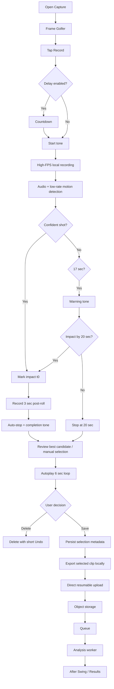
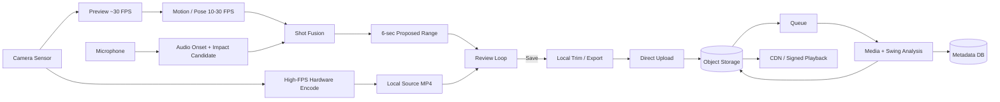

# Golf Swing Capture, Detection, Review, Upload, and Analysis
## Engineering + Product Handoff Package

**Status:** Planning specification  
**Target:** React Native mobile app, iOS + Android  
**Primary use case:** A golfer places a phone, records one swing at high frame rate, the app automatically finds the actual shot, proposes a 6-second clip centered around impact, the golfer verifies it, then the app trims/uploads/analyzes it.  
**Baseline scale:** 1,000 users, 1 saved swing per user per day, approximately 30,000 saved swings/month.

---

## 1. Canonical Product Decisions

These are the current recommended decisions unless later testing disproves them.

1. **Record locally at the highest useful high-speed format the device can sustain.**
   - Prefer high FPS over 4K resolution for swing analysis.
   - Typical target hierarchy: 1080p240 -> 1080p120 -> 1080p60.
   - Allow device-specific alternatives such as 720p240 if that is the best stable high-FPS mode.
   - "Highest useful" means stable recording, acceptable exposure, acceptable file size, and no dropped frames.

2. **Do not run AI at recording FPS.**
   - Capture can be 120/240 FPS.
   - Preview may be around 30 FPS.
   - Motion/pose detection may inspect only 10-30 FPS.
   - Audio runs continuously and provides the most precise initial impact candidate.

3. **Separate three problems:**
   - Did the golfer perform a swing?
   - Did contact/impact occur?
   - What exact clip should be retained?

4. **Use an edge-first hybrid detector.**
   - Audio transient/onset detection identifies impact candidates.
   - Lightweight body movement verifies that the golfer is swinging.
   - Pose/temporal verification runs only when helpful.
   - Ball disappearance can be an optional confidence signal.
   - Server analysis can refine the exact impact and swing phases later.

5. **User verification is required in V1.**
   - The proposed swing immediately loops.
   - Default retained clip is exactly 6 seconds: 3 seconds before predicted impact + 3 seconds after.
   - The golfer can move a large filmstrip selection left/right.
   - The golfer presses Save or Delete.
   - This creates excellent correction/training data.

6. **Auto-stop after a confident shot.**
   - Once impact is confidently detected, retain 3 seconds post-impact and automatically stop.
   - The user can still manually stop.
   - If no shot is detected, warn near 17 seconds and end the shot-detection window at 20 seconds.
   - If impact happens near 20 seconds, allow the recording to continue up to 3 additional seconds so the follow-through is not cut off.

7. **Do not physically trim while the golfer is scrubbing.**
   - Review playback uses the original local recording with `selectionStart` and `selectionEnd`.
   - Export the 6-second derivative only after Save.

8. **Upload directly from device to object storage.**
   - Do not proxy video bytes through the API server.
   - API issues an upload authorization / signed URL.
   - Phone uploads directly to S3-compatible object storage.
   - Object-created event -> queue -> worker -> analysis.

9. **Store final clips as MP4 and serve with byte-range requests/CDN.**
   - HLS is unnecessary for a normal 6-second private clip at initial scale.
   - Add HLS/ABR only if longer video, public sharing, repeated coach viewing, or network adaptation makes it necessary.

10. **Keep the original source only as long as necessary.**
    - Local source remains until trim/export succeeds and server acceptance is confirmed.
    - Normally upload only the selected clip.
    - Low-confidence or failed-trim workflows may retain/upload a larger source temporarily.
    - Never silently lose the only copy of a swing.

---

## 2. Document Map

| File | Purpose |
|---|---|
| `01_PRODUCT_UX_SPEC.md` | Complete golfer journey, recording UX, review UI, sounds, scrubber, Save/Delete, edge cases |
| `02_CAPTURE_RECORDING_SPEC.md` | High-FPS camera requirements, device capability tiers, codecs, timestamps, local storage, file sizes |
| `03_SWING_DETECTION_TRIMMING.md` | Audio + motion + pose architecture, practice swing rejection, confidence model, pseudocode |
| `04_MEDIA_PIPELINE_PLAYBACK.md` | Review-loop implementation, thumbnails, local export, MP4, upload, playback/CDN |
| `05_BACKEND_CLOUD_ARCHITECTURE.md` | Cloud topology, queues, storage, workers, security, retention, scaling |
| `06_DATA_MODEL_API_CONTRACTS.md` | Database entities, fields, enums, APIs, state machines, idempotency |
| `07_MOBILE_IMPLEMENTATION_NOTES.md` | React Native/native boundaries, iOS/Android implementation guidance, background work |
| `08_TESTING_OBSERVABILITY_ML_FEEDBACK.md` | Test matrix, ground truth, telemetry, quality gates, thermal/performance testing |
| `09_COST_CAPACITY_MODEL.md` | 1k/day cost model and 10x/100x considerations |
| `10_IMPLEMENTATION_ROADMAP.md` | Recommended development sequence and acceptance criteria |
| `11_DECISIONS_OPEN_QUESTIONS.md` | Decision log and unresolved choices |
| `12_AI_CODER_MASTER_PROMPT.md` | Ready-to-use prompt for an AI coding/planning agent |
| `FULL_SPEC.md` | Concatenated version of the package |

---

## 3. Primary End-to-End Flow

---

## 4. Architecture at a Glance

---

## 5. Important Product Philosophy

The capture detector should not be thought of as "detect the sound of a golf ball."

It should be thought of as:

> **Detect that this golfer performed a golf swing, and establish evidence that contact occurred near a particular moment.**

Each signal answers a different question:

- **Audio:** when did a sharp impact-like event occur?
- **Motion/pose:** was the golfer actually swinging at that time?
- **Ball state:** did the ball likely leave the hitting area?
- **Temporal swing model:** does the motion sequence make sense as a golf swing?
- **User correction:** did the app choose the right swing?
- **Server high-FPS analysis:** what is the best final impact frame and phase timing?

The highest priority is **never losing a valid swing**. False positives are inconvenient. A false negative that discards the golfer's only swing is much worse.

---

## 6. Implementation Principle

Treat these documents as the product/architecture contract, not as an instruction to build everything at once.

Recommended V1:

- high-FPS local recording
- audio transient detector
- lightweight user-motion verification
- impact candidate
- 6-second review loop
- large thumbnail filmstrip
- Save/Delete
- local export
- direct object-storage upload
- server analysis
- telemetry recording the predicted and user-corrected ranges

Add heavier pose/ball/phase models only if real-world data shows they are needed.
