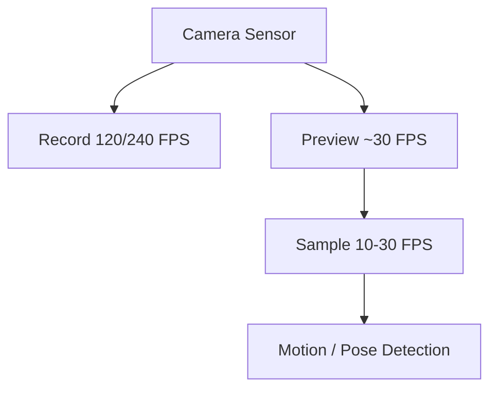

# 02. Capture and Recording Specification

## 1. Core Requirement

Capture golf swings at the **highest useful frame rate supported by the phone**, while keeping resolution and bitrate reasonable enough for:

- local temporary recording
- rapid review
- 6-second final clip export
- cellular upload
- downstream swing analysis

High FPS is central because a golf swing changes very quickly around transition and impact.

---

## 2. Capture FPS Is Not Detection FPS

These are separate pipelines.



Example:

- recording: 240 FPS
- preview: 30 FPS
- body detector: 15-20 FPS
- server analysis after save: all 240 FPS frames if needed

The detector does not need every recorded frame to determine whether the golfer's body is executing a swing.

---

## 3. Device Capability Discovery

Never hard-code 240 FPS.

At runtime, inspect:

- available cameras
- supported resolutions
- supported high-speed FPS ranges
- codec availability
- hardware encoding support
- preview limitations
- whether analysis/frame processor can coexist with high-speed video
- device thermal/performance history if collected

Create a normalized capability object.

Example:

```ts
type CaptureCapability = {
  cameraId: string
  lens: 'wide' | 'ultrawide' | 'telephoto' | 'front' | 'unknown'
  width: number
  height: number
  minFps: number
  maxFps: number
  codecs: Array<'h264' | 'hevc'>
  highSpeed: boolean
  previewSupported: boolean
  concurrentAnalysisSupported: boolean
}
```

---

## 4. Recommended Quality Selection Policy

Initial policy:

1. prefer 240 FPS if stable and enough resolution is available
2. otherwise 120 FPS
3. otherwise 60 FPS
4. avoid sacrificing so much exposure or resolution that body/club features become unusable

Suggested priority candidates:

| Priority | Example mode | Notes |
|---|---|---|
| 1 | 1080p240 | Excellent timing when supported and lighting is adequate |
| 2 | 1080p120 | Strong default high-speed target |
| 3 | 720p240 | Consider when 1080p240 unavailable and temporal detail matters more |
| 4 | 1080p60 | Broad fallback |
| 5 | device best | Last-resort compatible mode |

Do not blindly choose the numerically highest FPS if it requires a poor lens, unusable exposure, severe crop, or unstable encoder.

Expose advanced override later, not necessarily V1.

---

## 5. Resolution Tradeoff

The user requirement favors high FPS and controlled file size.

General guidance:

- 1080p is a strong target for golfer/body analysis
- 720p can be acceptable for impact timing/body pose if it enables substantially higher FPS
- 4K is usually less valuable than 120/240 FPS for this use case
- exact club-face analysis may ultimately depend on distance, shutter, lens, lighting, and club pixel size more than raw resolution alone

Use real captured datasets to decide whether 720p240 or 1080p120 produces better downstream model performance on each device family.

---

## 6. Shutter, Exposure, and Lighting

High FPS requires shorter frame intervals and generally more light.

Important:

- outdoor daylight is favorable
- dim indoor simulator environments may force high ISO/noise
- motion blur can still make the club difficult to track even at high FPS if shutter time is long
- FPS and shutter speed are different concepts

If manual controls are available and product testing supports them, consider:

- biasing toward faster shutter for club/body edge clarity
- locking focus after framing
- locking or stabilizing exposure/white balance once capture begins

Avoid an expert-camera setup experience for normal users. Automate this.

---

## 7. Stabilization and Geometric Analysis

The phone is normally fixed on a tripod or support.

For biomechanical analysis, a stable field of view is desirable.

Consider disabling digital stabilization if it:

- introduces crop changes
- warps geometry
- is unsupported in high-speed mode
- causes frame-to-frame transformations that complicate pose/club measurements

This must be device-tested rather than assumed.

---

## 8. Orientation

Lock capture orientation once recording begins.

Store:

- physical device orientation
- rendered rotation
- camera lens
- front/rear camera
- mirror state
- view type if known

Do not let orientation changes mid-swing alter encoded geometry.

---

## 9. Audio

Capture audio with the source video unless privacy/product requirements say otherwise.

For detection, independently downsample/process a cheap mono stream, e.g.:

- 16 kHz
- mono
- short frames
- onset/transient analysis

The final stored derivative may optionally have audio removed after detection if the product does not need it.

That can improve privacy when conversations occur at a golf range.

---

## 10. Temporary Source Duration

Normal maximum:

- up to 20 seconds waiting for impact
- plus up to 3 seconds post-impact
- approximately 23 seconds absolute normal maximum

If user manually stops earlier, use that duration.

---

## 11. Example Temporary File Sizes

Actual phone encoders vary significantly. Treat bitrate as measured input, not a constant.

Formula:

```text
size_MB ~= bitrate_Mbps * duration_seconds / 8
```

For a 23-second temporary source:

| Bitrate | Approx source size |
|---:|---:|
| 10 Mbps | 28.8 MB |
| 20 Mbps | 57.5 MB |
| 40 Mbps | 115 MB |
| 80 Mbps | 230 MB |

For a 6-second saved clip:

| Bitrate | Approx final size |
|---:|---:|
| 10 Mbps | 7.5 MB |
| 20 Mbps | 15 MB |
| 40 Mbps | 30 MB |
| 80 Mbps | 60 MB |

This is why **local trimming before upload** is important even though cloud storage itself is inexpensive.

---

## 12. Local Source Storage

Use application-private temporary storage.

Requirements:

- source survives transition to Review
- source survives a recoverable app interruption if practical
- source is not deleted until:
  1. user deletes and Undo expires, or
  2. saved derivative exports successfully and server acceptance policy is satisfied
- orphaned temp files are cleaned by a maintenance job

Suggested states:

```text
recording
finalizing
reviewable
exporting
queued_for_upload
uploaded
safe_to_delete_source
deleted
```

---

## 13. Encoded Ring Buffer: Future Range Mode

For future hands-free range mode, avoid retaining uncompressed frames.

Use a rolling sequence of encoded fragments/segments:

- retain recent N seconds on disk/cache
- overwrite old fragments
- when impact occurs, preserve pre-roll fragments
- capture post-roll
- stitch/export the selected clip

This is much more memory-efficient than storing raw 240 FPS frames.

---

## 14. Codec

### H.264

Pros:
- universal playback
- broad tooling
- simple web/client compatibility

Cons:
- larger files at equivalent quality

### HEVC/H.265

Pros:
- smaller file for similar quality
- useful for high-FPS local storage

Cons:
- compatibility/tooling/licensing considerations
- server analysis stack must support it
- some browser environments are less predictable

Recommendation:

- support source codec chosen by device/hardware
- normalize only when downstream analysis/serving requires it
- do not transcode merely for architectural neatness

---

## 15. Keyframes / GOP

If encoder control allows it, a moderate keyframe interval such as ~0.5-1 second can improve fast trimming/seeking without forcing all-intra encoding.

Tradeoff:

- more frequent keyframes: easier cuts/seeks, larger file
- longer GOP: smaller file, more re-encode may be needed around cut points

Measure on actual hardware.

---

## 16. Timestamps

Accurate timestamps matter more than wall-clock time.

Store monotonic media-time values for:

- recording start
- detector sample timestamps
- each impact candidate
- selected impact
- selection start/end
- manual correction
- encoding completion

Do not rely on JavaScript `Date.now()` as the sole frame/impact alignment mechanism.

Native media presentation timestamps should be the source of truth.

---

## 17. Android High-Speed Constraints

Modern CameraX supports high-speed recording, commonly 120/240 FPS, but high-speed sessions have stricter combinations than normal camera sessions.

Important current Android behavior:

- high-speed recording is a special constrained mode
- preview may be present but normally runs at a lower rate than the recording stream
- not every normal CameraX use case/effect is available in high-speed mode
- device-supported high-speed capabilities must be queried

Design consequence:

> The app must support devices where high-speed recording and a normal CPU image-analysis stream cannot run together.

Fallback:

1. record high-speed video
2. run continuous audio detection
3. use available preview/motion data if supported
4. after candidate/stop, locally inspect a short decoded video interval to verify swing motion

This preserves high-FPS recording even on constrained hardware.

---

## 18. iOS High-Speed Constraints

Use AVFoundation-native format discovery.

Select an `AVCaptureDeviceFormat` with a supported high frame-rate range and configure the device accordingly.

As with Android:

- choose supported format, not an assumed one
- keep real-time processing lighter than recording
- avoid blocking the capture queue
- drop analysis frames if analysis is behind rather than harming the recording

---

## 19. Capture Failure Handling

Examples:

### Not enough storage
Before starting:
- estimate a safe temporary-space requirement
- block capture with clear recovery if insufficient

### Thermal pressure
- detect/observe thermal state where possible
- gracefully fall back to lower FPS if required
- record telemetry about selected mode and fallback

### Encoder/camera failure
- surface a concise retry
- retain already finalized source when possible

### Incoming call/app background
- capture APIs may be interrupted
- finalize or mark attempt interrupted
- never pretend a complete swing was saved when the media is incomplete

---

## 20. External Technical References

- Android CameraX high-speed video API: https://developer.android.com/reference/androidx/camera/video/HighSpeedVideoSessionConfig
- Android CameraX releases / high-speed support: https://developer.android.com/jetpack/androidx/releases/camera
- Android CameraX architecture: https://developer.android.com/media/camera/camerax/architecture
- Apple AVFoundation capture documentation: https://developer.apple.com/av-foundation/
