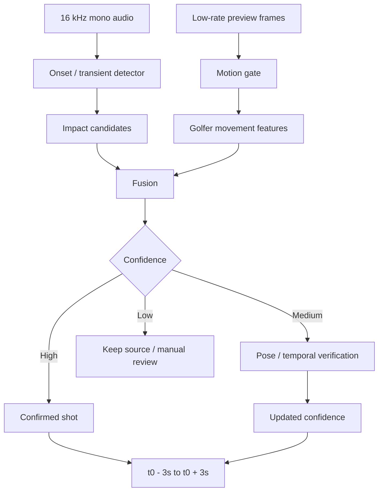
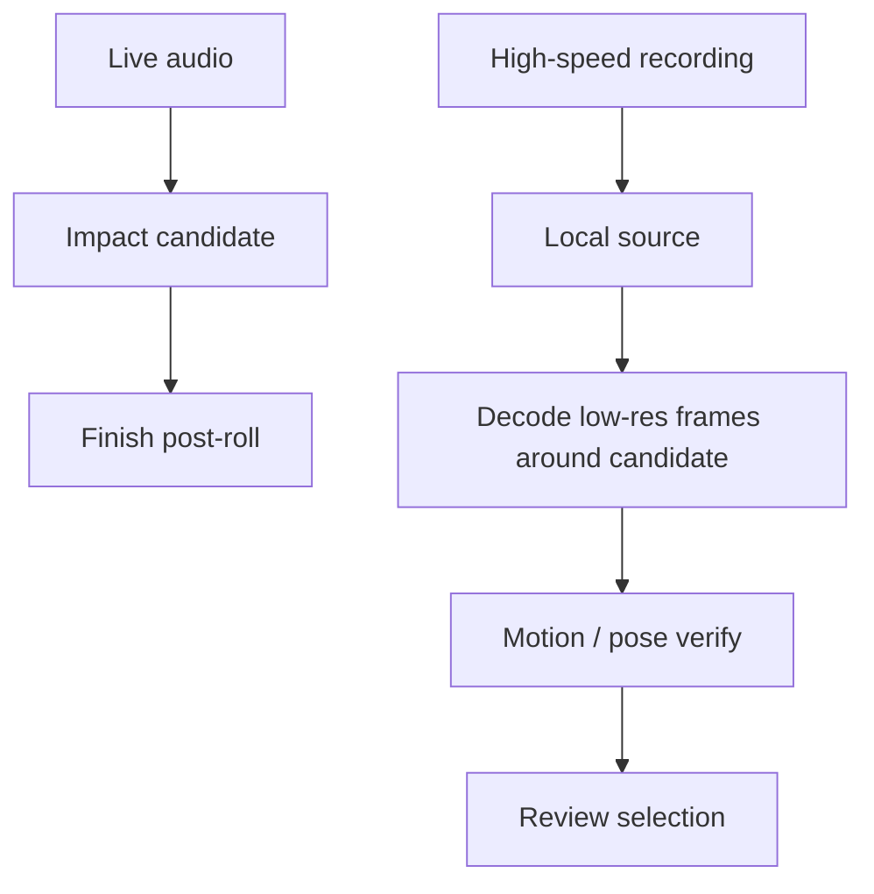

# 03. Swing Detection and Trimming

## 1. Goal

Automatically propose the **actual hit**, not a practice swing, using the cheapest reliable on-device signals.

The detector does not need to perfectly classify biomechanics. It must:

1. identify likely contact time
2. verify that the phone's golfer was performing a swing around that time
3. reject nearby impacts/noise when possible
4. choose the best candidate
5. produce a proposed 6-second window
6. never destroy the source if uncertain

---

## 2. Decompose the Problem

### Impact detection
"When did something impact?"

Best first signal: audio transient.

### Swing detection
"Was the golfer on camera actually swinging?"

Signals:
- body motion
- pose landmark motion
- temporal pattern

### Ownership
"Was that impact caused by our golfer rather than someone nearby?"

Signals:
- user swing overlaps impact
- body/hand velocity peaks near impact
- tracked person identity/location
- optional ball disappearance
- phase consistency

### Trimming
"What six seconds should the user review/save?"

Default:
- 3 sec before impact
- 3 sec after impact

---

## 3. Recommended Edge Pipeline



---

## 4. Audio Onset Detection

Do not use a simple amplitude threshold.

Use onset-detection concepts such as:

- spectral flux
- high-frequency content
- complex-domain onset
- adaptive local noise floor
- peak picking
- refractory/debounce interval

Golf impact is a transient event.

A basic process:

```text
audio frames
  -> frequency-domain / onset feature
  -> adaptive normalization
  -> candidate peak detection
  -> short candidate window
  -> golf-impact classifier
```

The detector is cheap enough to run continuously during a short capture.

---

## 5. Impact Classifier

A custom classifier should learn hard negatives, not only "golf vs silence."

Suggested classes:

- golf_ball_impact
- club_ground_impact
- club_mat_impact
- simulator_screen_impact
- nearby_golf_shot
- bucket/club clank
- clap
- speech transient
- other_transient

For an MVP, pretrained audio embeddings such as YAMNet can be used to prototype a classifier. Production should likely move toward a smaller task-specific model after enough labeled data exists.

Candidate audio window can be short, e.g. roughly:

- -300 ms before onset
- +400 ms after onset

Exact values should be tuned.

---

## 6. Why Audio Should Not Act Alone

At a driving range:

- adjacent golfers hit balls
- clubs hit mats
- buckets clank
- carts and voices create transients

Therefore:

```text
impact-like sound
        +
our golfer was executing a swing
        =
much stronger shot evidence
```

---

## 7. Cheap Motion Gate

Before running expensive pose inference, use inexpensive visual evidence.

Possible methods:

- frame differencing
- downsampled optical flow
- foreground motion in a golfer ROI
- tracked person bounding-box movement
- hand/upper-body motion if landmarks already available

Input can be small, e.g. 256-512 px side.

Detection cadence can be ~10-30 FPS even when recording 120/240 FPS.

---

## 8. Pose Verification

When needed, use a pose model such as MediaPipe Pose Landmarker.

Useful landmarks/features:

- shoulders
- elbows
- wrists
- hips
- knees
- ankles

The goal is not perfect swing coaching here.

Useful real-time features:

- wrist speed
- hand path magnitude
- shoulder rotation proxy
- hip rotation proxy
- vertical/horizontal hand travel
- direction reversal near transition
- rapid downswing movement
- follow-through movement after candidate impact

Pose can verify a golf-like motion sequence around an audio candidate.

---

## 9. Temporal Phase Verification

GolfDB demonstrates that golf videos can be segmented into events including:

- address
- toe-up
- mid-backswing
- top
- mid-downswing
- impact
- mid-follow-through
- finish

A temporal model can eventually provide stronger swing-phase consistency.

Important caveat:

GolfDB contains swing-centric clips. Accuracy reported on that dataset should **not** be interpreted as equivalent performance on arbitrary 20-second phone recordings with walking, practice swings, adjacent golfers, and noise.

Use such a model as a reference architecture or downstream verifier, not a magical off-the-shelf solution.

---

## 10. Optional Ball Evidence

If the ball region can be found reliably:

- ball present before impact
- ball absent after impact

can provide a strong confidence increment.

Do not make this mandatory in V1 because:

- ball is tiny
- golfer/club may occlude it
- white ball/background contrast varies
- camera angle varies
- range mats and grass vary
- resolution/distance vary

Treat it as a verifier, not the only detector.

---

## 11. Practice Swing Rejection

Ideal signal matrix:

| Visual user swing | Impact audio | Interpretation |
|---|---|---|
| yes | yes | likely real shot |
| yes | no | likely practice swing |
| no | yes | likely nearby golfer/noise |
| no | no | no shot |
| yes | weak/ambiguous | run deeper verification |

A practice swing may still create club swish or mat contact, so the classifier and temporal evidence matter.

---

## 12. Nearby Golfer Rejection

Track the user's person/body region during recording.

For each audio candidate:

- was tracked golfer moving?
- did hand/wrist velocity peak near the candidate?
- was there a plausible backswing before?
- was there follow-through after?
- did optional ball state change?

An audio candidate without corresponding user motion should be heavily discounted.

---

## 13. Ground/Mat Strike Near Ball Impact

A golf shot can produce multiple closely spaced transients.

Do not assume the loudest peak is the ball.

Process a short cluster of peaks:

1. group peaks separated by a small threshold
2. classify each/combined acoustic shape
3. compare with predicted visual impact phase
4. choose candidate nearest the visual impact expectation
5. retain all raw candidates for telemetry

Tune thresholds empirically.

---

## 14. Illustrative Fusion Model

Example only:

```text
score =
  0.50 * audioImpactConfidence +
  0.30 * visualSwingConfidence +
  0.15 * phaseConsistency +
  0.05 * ballEvidence
```

Do not ship these exact weights merely because they appear here.

Train/calibrate with real captured data.

---

## 15. Confidence-Based Behavior

Suggested starting policy:

| Confidence | Behavior |
|---|---|
| >= 0.90 | auto-stop after +3 sec, propose 6 sec |
| 0.65-0.90 | stop normally, show review with candidate markers |
| < 0.65 | retain entire source and emphasize manual selection |

The exact thresholds require validation.

Product priority:

> False negatives that cause lost swings are worse than an occasional manual correction.

---

## 16. Multiple Candidate Selection

For each candidate `i`, keep:

```ts
type ShotCandidate = {
  timeSec: number
  audioScore: number
  visualSwingScore: number
  phaseScore?: number
  ballScore?: number
  fusedScore: number
  source: string[]
}
```

Choose max fused score as default.

Expose other candidates to review as subtle timeline markers.

---

## 17. High-FPS Recording With Low-Rate Detection

At 240 FPS, 15 FPS detection means approximately one analyzed frame out of every 16 recorded frames.

This is fine.

The local detector only needs to establish a broad temporal sequence around impact.

The high-FPS source is preserved for later precision analysis.

---

## 18. Constrained Device Fallback

Some high-speed camera modes will not permit the desired live image-analysis stream.

Fallback architecture:



Verification can happen after recording, locally, before Review or just after Review begins.

This is still a good UX because only a few seconds of video need to be sampled.

---

## 19. Pseudocode

```ts
onRecordingStarted() {
  candidates = []
  motionHistory.start()
  audioDetector.start()
}

onAudioOnset(onset) {
  if (isKnownAppSoundWindow(onset.time)) return

  const audio = impactClassifier.classify(onset.window)
  if (audio.score < AUDIO_MIN) return

  const motion = motionHistory.scoreWindow(
    onset.time - 1.5,
    onset.time + 0.8
  )

  let candidate = fuse(audio, motion)

  if (candidate.confidence >= HIGH_CONFIDENCE) {
    confirmShot(candidate)
  } else if (candidate.confidence >= MEDIUM_CONFIDENCE) {
    enqueuePoseVerification(candidate)
  } else {
    candidates.push(candidate)
  }
}

confirmShot(candidate) {
  selectedImpact = candidate.time
  scheduleStopAt(candidate.time + 3.0)
}

onRecordingFinalized(file) {
  const best = chooseBestCandidate(candidates, selectedImpact)

  if (best) {
    review.start = max(0, best.time - 3)
    review.end = min(file.duration, best.time + 3)
  } else {
    review = makeManualFallback(file)
  }

  openReview(file, review, candidates)
}
```

---

## 20. User Corrections as Training Data

Store:

- model-selected impact
- selected six-second start/end
- amount user shifted range
- whether user picked another candidate
- whether user deleted
- device/camera/FPS
- environmental tags if inferable
- detector/model versions

Do not automatically treat every Save as exact ground-truth impact.

But a large shift from the prediction is strong evidence of a wrong candidate.

A later server model can derive refined impact and compare it with edge prediction.

---

## 21. Dataset Requirements

Collect real-world examples across:

- driving range with adjacent golfers
- empty range
- golf course
- indoor simulator
- mat
- grass
- driver
- fairway woods
- irons
- wedges
- chips/partial shots
- fat shots
- thin shots
- topped shots
- misses
- practice swings
- left-handed and right-handed golfers
- face-on and down-the-line
- close/far framing
- bright sun
- shade
- dusk
- indoor dim light
- wind
- speech
- music
- carts
- club/bucket clanks

Label event-level truth.

Metrics:

- shot precision/recall
- impact timing error
- practice swing false-positive rate
- nearby-shot false-positive rate
- "valid swing lost" rate
- percent requiring user adjustment

---

## 22. External References

- GolfDB / SwingNet paper: https://openaccess.thecvf.com/content_CVPRW_2019/papers/CVSports/McNally_GolfDB_A_Video_Database_for_Golf_Swing_Sequencing_CVPRW_2019_paper.pdf
- MediaPipe Pose Landmarker: https://developers.google.com/edge/mediapipe/solutions/vision/pose_landmarker
- Essentia onset detection tutorial: https://essentia.upf.edu/tutorial_rhythm_onsetdetection.html
- TensorFlow Hub YAMNet tutorial: https://www.tensorflow.org/hub/tutorials/yamnet
