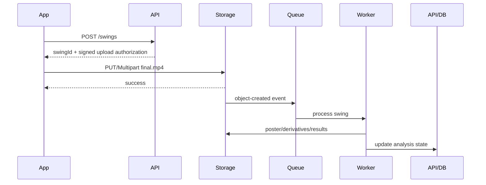

# 04. Media Pipeline and Playback

## 1. Principle

Do not export/trim every time the review selection moves.

Review uses the original local source plus time bounds.

Only produce the upload derivative after Save.

---

## 2. Local Review Model

Store:

```ts
type ReviewSelection = {
  sourceUri: string
  detectedImpactSec: number | null
  selectedImpactSec: number | null
  selectionStartSec: number
  selectionEndSec: number
  durationSec: 6
  candidateTimesSec: number[]
}
```

Playback:

1. seek to `selectionStartSec`
2. play
3. when playback reaches `selectionEndSec`, seek to start
4. repeat
5. update filmstrip playhead

Use native player timing callbacks or a robust playback abstraction.

---

## 3. Filmstrip Thumbnails

Generate low-resolution thumbnails for the timeline.

Guidance:

- do not decode every high-FPS frame
- generate perhaps 10-24 thumbnails across the full source depending on UI width
- cache them for the review session
- keep thumbnail resolution only as high as needed for display
- generation may start while the video is finalizing

Platform APIs:

- iOS: `AVAssetImageGenerator`
- Android: `MediaMetadataRetriever.getScaledFrameAtTime()` or a media decoding pipeline

React Native can render the resulting thumbnails in a custom filmstrip.

---

## 4. Scrubber Mechanics

Preferred primary interaction:

- fixed 6-second selection width
- horizontal pan/drag changes selection center
- clamp to file boundaries
- impact marker moves with selected candidate or remains a model-estimate marker depending interaction design
- candidate ticks are tappable

For 20-second source:

```text
timelineWidthPx / sourceDuration = pixelsPerSecond
```

Convert drag delta:

```text
deltaSec = deltaPx / pixelsPerSecond
```

Selection:

```text
newStart = clamp(oldStart + deltaSec, 0, duration - 6)
newEnd = newStart + 6
```

---

## 5. Export on Save

On Save:

1. snapshot final selection metadata
2. create Swing record locally/server-side
3. start trim/export
4. produce final MP4
5. create poster thumbnail
6. queue direct upload
7. allow UI to leave Review immediately

Do not block user interaction while export/upload completes.

---

## 6. Trim Strategy

There are two kinds of cut:

### Fast approximate/keyframe-aligned trim
Pros:
- very fast
- minimal processing

Cons:
- may retain a little extra around start boundary depending container/GOP

### Frame-accurate trim
Pros:
- exact boundary

Cons:
- may require partial/full re-encode

For this product, the **exact six-second boundary is not biomechanically meaningful**.

The critical thing is that the swing is inside the clip and the model retains accurate timestamps.

Prefer the fastest stable trim that preserves decodability and quality.

If needed, allow a few hundred milliseconds of hidden/extra encoded material while exposing logical playback range.

---

## 7. Android Export

Use AndroidX Media3 Transformer or a native module around it.

Media3 Transformer supports:

- trimming
- transcoding when required
- transmuxing where possible
- MP4 output
- H.264/AAC workflows
- trim optimizations

Do not perform high-FPS media processing on the React Native JS thread.

---

## 8. iOS Export

Use AVFoundation-native export/editing.

Potential components:

- `AVAsset`
- `AVAssetExportSession`
- compositions if needed
- passthrough preset when compatible
- re-encode only when required

Build a native bridge/module so the JS layer requests:

```ts
trimVideo({
  sourceUri,
  startSec,
  endSec,
  outputUri,
  preferredCodec
})
```

and receives progress/completion events.

---

## 9. MP4 Playback Optimization

For final stored videos:

- MP4 container
- compatible codec
- `moov` metadata positioned for fast startup when applicable
- HTTP byte-range support
- private signed access

For six-second clips, progressive MP4 is simpler than HLS.

---

## 10. HLS Decision

Do **not** generate HLS by default in V1.

Use HLS/ABR later when:

- clips become much longer
- network adaptation is important
- public/shared video becomes common
- coaches repeatedly stream many clips
- multiple resolutions are useful
- browser/device compatibility demands renditions

Every rendition multiplies storage/processing complexity.

---

## 11. Direct Upload

Recommended flow:



Never stream the entire video through the general application API unless there is a specific reason.

---

## 12. Upload Reliability

At 6 seconds, final clips may still be 15-60+ MB depending high-speed bitrate.

Requirements:

- upload queue persisted to disk/database
- network retry
- app restart recovery
- idempotent upload
- Wi-Fi/cellular awareness if product settings use it
- user can capture the next swing without waiting

Possible approaches:

### Simple signed PUT
Good when:
- final files stay modest
- native networking handles retries
- implementation simplicity matters

### Multipart/resumable
Better when:
- weak cellular networks are common
- files are large
- background interruption is common

AWS S3 multipart permits independent part retries. Google Cloud Storage offers resumable uploads if using GCP.

---

## 13. Upload/Source Deletion Contract

Recommended safe sequence:

```text
source recorded
  -> user reviews
  -> user saves
  -> derivative export succeeds
  -> derivative upload succeeds
  -> server confirms object is valid/accepted
  -> local source may be deleted
```

The local final derivative may be retained longer for offline replay/cache according to product policy.

---

## 14. Privacy

Recording at a range may capture:

- nearby people
- conversations
- unrelated pre-shot footage

Edge trimming reduces the amount uploaded.

Optional policy:

- use audio for on-device impact detection
- strip audio from final analysis derivative if sound is not needed by the product
- retain audio only if useful for later impact synchronization/analysis

Make this a deliberate product/privacy decision.

---

## 15. Two-Camera Extension

If the app later records the same swing on two phones:

- each phone records locally
- network trigger time is not precise enough for perfect frame synchronization
- retain audio on both devices during capture
- server can align the two clips by cross-correlating impact/audio waveforms
- then refine using detected impact/frame events

This can provide more reliable synchronization than assuming both devices started recording at exactly the same network timestamp.

---

## 16. External References

- Android Media3 Transformer: https://developer.android.com/media/media3/transformer
- Android transformations/trimming: https://developer.android.com/media/media3/transformer/transformations
- AWS S3 multipart uploads: https://docs.aws.amazon.com/AmazonS3/latest/userguide/mpuoverview.html
- Google Cloud resumable uploads: https://docs.cloud.google.com/storage/docs/resumable-uploads
- Apple AVAssetImageGenerator: https://developer.apple.com/documentation/avfoundation/avassetimagegenerator
- Android MediaMetadataRetriever: https://developer.android.com/reference/android/media/MediaMetadataRetriever
