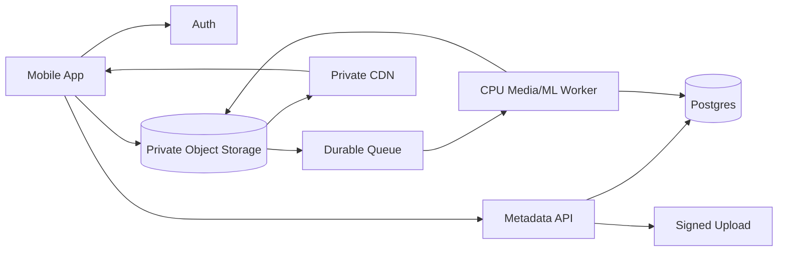

# 05. Backend and Cloud Architecture

## 1. Goals

The backend should:

- accept metadata cheaply
- keep video bytes out of the main API server
- tolerate upload retries
- process asynchronously
- scale from 1,000/day to much larger volumes
- keep private media private
- support idempotent processing
- make failures recoverable
- expose analysis state to the app

---

## 2. Recommended Baseline Stack

A pragmatic baseline if the product already uses Supabase:

- **Supabase Auth**: identity/passwordless auth
- **Postgres/Supabase DB**: swing metadata, media state, model outputs
- **S3**: private video/object storage
- **CloudFront**: private playback/CDN
- **SQS**: durable processing queue
- **ECS/Fargate or another container worker**: FFmpeg/OpenCV/ML jobs
- **Lambda/Edge/API functions**: lightweight orchestration, signing, state transitions
- **CloudWatch/Sentry/PostHog or existing observability stack**: logs/product telemetry

Equivalent GCP/Azure architectures are valid.

---

## 3. Core Topology



---

## 4. Upload Flow

1. user presses Save
2. app creates or finalizes local `swingId`
3. app calls metadata API
4. API validates user and returns signed upload target
5. app directly uploads final clip
6. object creation creates a processing event
7. event is queued
8. worker validates media
9. worker extracts metadata/poster
10. swing analysis runs
11. outputs are stored
12. DB status becomes ready
13. client receives status by polling/realtime/subscription mechanism

---

## 5. Why Direct-to-Storage

Avoid:

```text
phone -> Node/Next/Python API -> S3
```

Prefer:

```text
phone -> S3
```

with API authorization.

Benefits:

- API does not pay double bandwidth/memory pressure
- large request timeouts are avoided
- retry logic is simpler
- scale is easier
- object storage is designed for this traffic

---

## 6. Object Key Structure

Use opaque IDs, no PII.

Example:

```text
swings/{user_uuid}/{swing_uuid}/source.mp4
swings/{user_uuid}/{swing_uuid}/poster.jpg
swings/{user_uuid}/{swing_uuid}/analysis.json
swings/{user_uuid}/{swing_uuid}/overlay.mp4
```

If there are multiple cameras:

```text
swings/{user_uuid}/{swing_uuid}/views/{view_uuid}/source.mp4
```

---

## 7. Private Media

Recommended:

- S3 bucket private
- block public access
- CloudFront Origin Access Control
- signed playback URLs or signed cookies
- authorization based on swing ownership/coach permissions
- short-lived upload signatures
- content-type and expected-size constraints where feasible

---

## 8. Queue Design

Use a durable queue so a burst of uploads does not require a burst of synchronous compute.

Queue message:

```json
{
  "schemaVersion": 1,
  "swingId": "uuid",
  "userId": "uuid",
  "objectKey": "swings/.../source.mp4",
  "attempt": 0
}
```

Worker must be idempotent.

If the same event is delivered twice, processing must not duplicate or corrupt the swing.

---

## 9. Processing Stages

Suggested pipeline:

```text
uploaded
 -> validating
 -> media_ready
 -> detecting/refining impact
 -> biomechanical_analysis
 -> rendering_derivatives (optional)
 -> ready
```

Do not couple every stage into one giant job if independent retries would help.

At V1 scale, one worker can execute stages sequentially while the database stores stage state.

---

## 10. CPU vs GPU

At 1,000 swings/day, avoid GPU unless a chosen swing-analysis model truly requires it.

Capture-side impact detection should be on-device.

Server responsibilities may include:

- media validation
- frame extraction
- pose inference
- club tracking
- high-FPS temporal analysis
- scoring
- overlays

Benchmark the actual model.

A sophisticated deep CV model may dominate infrastructure cost long before storage does.

---

## 11. Container Compute

Containers are a good fit for:

- FFmpeg
- OpenCV
- native video libraries
- Python ML
- model files
- deterministic dependencies

AWS options:

- ECS service with workers polling SQS
- Fargate tasks
- EC2-backed ECS once utilization justifies it
- Fargate Spot for interruption-tolerant work

Important Fargate nuance:

- Linux billing is per second
- **one-minute minimum applies**
- launching a separate short task for every tiny job may be less efficient than a long-lived worker service or batched jobs

At 30,000 jobs/month, prefer a small queue worker service or benchmark task-per-swing economics.

---

## 12. Serverless Use

Use Lambda/serverless for lightweight work:

- create swing record
- sign upload
- object-event handling
- enqueue job
- status/webhook glue
- cleanup orchestration

Avoid forcing heavy FFmpeg/ML workloads into Lambda unless benchmarked and operationally appropriate.

---

## 13. Retention

### Local source
Keep until:
- user deletes, or
- final clip accepted by backend

### Cloud original
Normally not uploaded if local trimming succeeds.

If a larger source is uploaded due low confidence/failure:
- treat as temporary
- delete after successful analysis, perhaps 24h-7d depending debugging/product needs

### Final analysis clip
Keep according to user plan/product retention.

### Derived thumbnails/JSON
Small, can generally follow final swing lifecycle.

---

## 14. Lifecycle Tiering

For long retention:

- recent clips: S3 Standard
- older clips rarely viewed: consider Intelligent-Tiering/Standard-IA where economics fit
- archival tiers only if retrieval delay and minimum-retention rules fit product behavior

Do not move tiny/recently accessed objects blindly. Storage class fees/minimum durations matter.

---

## 15. CDN / Playback

For private six-second clips:

- CloudFront
- signed URL/cookie
- range requests
- cache according to privacy/access design
- no HLS initially

Current CloudFront pay-as-you-go free tier includes 1 TB/month data transfer out and 10 million HTTP/HTTPS requests across the account.

AWS also offers newer flat-rate CloudFront plans. Treat pricing as a deployment-time decision because eligibility and product needs change.

---

## 16. Failure Handling

### Upload fails
- local derivative remains
- upload queue retries
- UI says Pending Upload

### Object uploaded but event lost/delayed
- reconciliation job finds objects/swings stuck in uploaded state

### Worker crashes
- queue visibility timeout + retry
- idempotent worker

### Poison media
- dead-letter queue
- mark swing `processing_failed`
- preserve media for retry/debugging according to policy

### Analysis model failure
- separate from media upload success
- user still owns playable swing even if analysis failed

---

## 17. Security

- auth on all metadata operations
- private media
- opaque keys
- least-privilege IAM
- upload signature limited to exact key and method
- validate content length/type
- malware/media validation if product risk warrants it
- encrypt at rest
- TLS in transit
- audit access to coach/shared swings
- never put user PII in S3 object key names

---

## 18. Observability

Track backend:

- upload starts/completions/failures
- object size
- processing queue depth
- queue age
- worker duration
- worker retry count
- analysis success rate
- processing latency p50/p95/p99
- cost per processed swing
- CDN bytes served
- source cleanup failures

---

## 19. Scale Strategy

### ~1,000 saved swings/day
- simple
- one small worker service may be enough
- storage/CDN cheap
- no GPU unless model requires it

### ~10,000/day
- autoscaling worker pool
- stronger queue dashboards
- storage lifecycle
- cost-per-swing tracking
- CDN plan optimization

### ~100,000/day
- partition workload
- autoscale CPU/GPU queues independently
- model batching
- reserved/savings/spot strategies
- multi-region/CDN considerations as product geography requires
- lifecycle and derived-media strategy become financially meaningful

---

## 20. External References

- AWS S3 pricing: https://aws.amazon.com/s3/pricing/
- AWS general pricing page showing S3 Standard tier examples: https://aws.amazon.com/pricing/
- AWS CloudFront pricing: https://aws.amazon.com/cloudfront/pricing/
- CloudFront FAQ/free tier: https://aws.amazon.com/cloudfront/faqs/
- CloudFront flat-rate plans: https://docs.aws.amazon.com/AmazonCloudFront/latest/DeveloperGuide/flat-rate-pricing-plan.html
- AWS ECS pricing: https://aws.amazon.com/ecs/pricing/
- AWS Fargate pricing: https://aws.amazon.com/fargate/pricing/
