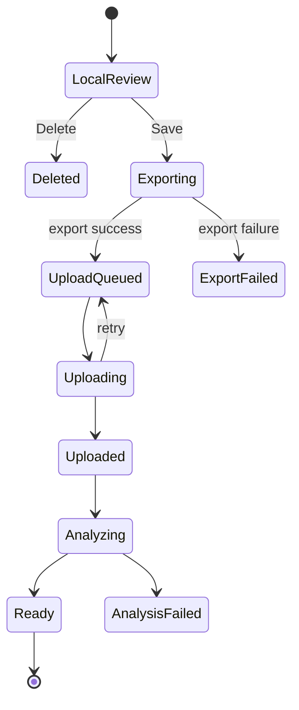

# 06. Data Model and API Contracts

## 1. Design Goals

Data model must preserve:

- original capture facts
- detector predictions
- user corrections
- upload state
- analysis state
- model/detector versions
- media object references
- multi-camera extensibility
- idempotency

Do not store video bytes in Postgres.

---

## 2. Swing Entity

Example relational model:

```sql
create table swings (
  id uuid primary key,
  user_id uuid not null,

  created_at timestamptz not null,
  updated_at timestamptz not null,

  status text not null,
  upload_status text not null,
  analysis_status text not null,

  capture_started_at timestamptz,
  capture_duration_ms integer,

  detected_impact_ms integer,
  detected_impact_confidence real,

  selected_start_ms integer,
  selected_end_ms integer,
  user_adjusted_selection boolean default false,

  capture_fps real,
  capture_width integer,
  capture_height integer,
  capture_codec text,
  capture_bitrate_bps bigint,

  camera_position text,
  camera_lens text,
  golf_view text,

  detector_version text,
  model_version text,

  source_object_key text,
  poster_object_key text,
  analysis_object_key text,

  source_deleted_at timestamptz,
  processing_error_code text,
  processing_error_message text
);
```

Adapt to existing conventions.

---

## 3. Capture Attempt Entity

It may be useful to distinguish **capture attempts** from saved swings.

Why:

- deleted attempts still contain detector-quality telemetry
- timeout attempts are useful model data
- one attempt can contain multiple candidates
- the user may never save it

```sql
capture_attempts (
  id uuid,
  user_id uuid,
  started_at,
  ended_at,
  result, -- saved/deleted/timeout/interrupted
  local_duration_ms,
  fps,
  width,
  height,
  codec,
  detector_version,
  device_model_hash_or_normalized_name,
  os_version,
  thermal_state,
  created_at
)
```

Privacy policy should decide what deleted-attempt telemetry is retained.

---

## 4. Shot Candidate Entity

```sql
shot_candidates (
  id uuid,
  capture_attempt_id uuid,
  candidate_time_ms integer,
  audio_score real,
  motion_score real,
  pose_score real,
  phase_score real,
  ball_score real,
  fused_score real,
  selected_by_model boolean,
  selected_by_user boolean,
  rank integer
)
```

This becomes valuable for model evaluation.

---

## 5. Media Asset Entity

For future multiple views/derivatives:

```sql
media_assets (
  id uuid,
  swing_id uuid,
  capture_attempt_id uuid,

  role text, -- source/final/poster/overlay/thumbnail
  view text, -- face_on/down_the_line/etc
  storage_provider text,
  bucket text,
  object_key text,

  mime_type text,
  codec text,
  width integer,
  height integer,
  fps real,
  duration_ms integer,
  size_bytes bigint,

  checksum text,
  upload_status text,
  created_at timestamptz,
  uploaded_at timestamptz,
  deleted_at timestamptz
)
```

---

## 6. Analysis Run Entity

Never overwrite history without knowing which model generated it.

```sql
analysis_runs (
  id uuid,
  swing_id uuid,
  model_version text,
  pipeline_version text,
  status text,
  started_at timestamptz,
  completed_at timestamptz,
  refined_impact_ms integer,
  result_object_key text,
  error_code text
)
```

---

## 7. Suggested Enums

### Swing status
- draft
- saved
- ready
- deleted

### Upload status
- none
- local_only
- queued
- uploading
- uploaded
- failed

### Analysis status
- none
- queued
- processing
- ready
- failed

### Capture result
- saved
- deleted
- timeout
- manual_stop
- auto_stop
- interrupted
- failed

---

## 8. Create Swing API

```http
POST /v1/swings
Authorization: Bearer <token>
Idempotency-Key: <uuid>
Content-Type: application/json
```

Request:

```json
{
  "captureAttemptId": "uuid",
  "detectedImpactMs": 12432,
  "detectedImpactConfidence": 0.94,
  "selectedStartMs": 9432,
  "selectedEndMs": 15432,
  "capture": {
    "fps": 240,
    "width": 1920,
    "height": 1080,
    "codec": "hevc",
    "bitrateBps": 40000000,
    "durationMs": 16220
  }
}
```

Response:

```json
{
  "swingId": "uuid",
  "mediaAssetId": "uuid",
  "upload": {
    "strategy": "signed_put",
    "url": "<signed>",
    "headers": {
      "Content-Type": "video/mp4"
    },
    "expiresAt": "..."
  }
}
```

---

## 9. Upload Complete

Possible patterns:

### Preferred
Object storage event is authoritative.

The client does not have to tell the server upload completed, though it may update UX state.

### Optional client callback

```http
POST /v1/swings/{swingId}/upload-complete
```

Server must still verify object exists/check metadata.

---

## 10. Swing Status API

```http
GET /v1/swings/{swingId}
```

Response:

```json
{
  "id": "uuid",
  "uploadStatus": "uploaded",
  "analysisStatus": "processing",
  "media": {
    "playbackUrl": null,
    "posterUrl": null
  }
}
```

When ready:

```json
{
  "id": "uuid",
  "uploadStatus": "uploaded",
  "analysisStatus": "ready",
  "media": {
    "playbackUrl": "<short-lived signed url>",
    "posterUrl": "<short-lived signed url>"
  },
  "analysis": {
    "impactMs": 3011,
    "score": 82
  }
}
```

---

## 11. Candidate Telemetry API

Can be batched.

```http
POST /v1/capture-attempts/{id}/telemetry
```

Payload:

```json
{
  "detectorVersion": "edge-impact-0.1.0",
  "candidates": [
    {
      "timeMs": 6230,
      "audio": 0.72,
      "motion": 0.91,
      "fused": 0.75
    },
    {
      "timeMs": 12432,
      "audio": 0.97,
      "motion": 0.96,
      "fused": 0.95
    }
  ],
  "modelSelectionMs": 12432,
  "userSelectionStartMs": 9432,
  "userSelectionEndMs": 15432
}
```

Do not block Save on telemetry delivery.

---

## 12. Idempotency

All create/process operations must be safe to retry.

Rules:

- client creates UUID before network call
- repeated create with same idempotency key returns same swing
- storage key is derived from immutable IDs
- worker checks analysis run/version before starting duplicate work
- DB updates use state guards
- queue duplicate delivery is expected

---

## 13. State Machine



---

## 14. Multi-Camera Extensibility

Do not make `swing.source_object_key` the only long-term representation.

Use `media_assets` so a swing can have:

- face-on view
- down-the-line view
- top-down strike view
- poster
- analysis overlay
- source/final derivatives

Each view gets independent capture timestamps and sync metadata.

Possible sync fields:

```text
local_impact_time_ms
sync_offset_ms
sync_confidence
audio_fingerprint_id
```

---

## 15. Data Retention / Privacy Fields

Consider:

- consent/version
- source_retention_policy
- final_audio_present
- shared_with_coach
- visibility
- deletion_requested_at
- deletion_completed_at

Implement product/privacy policy deliberately rather than later.
