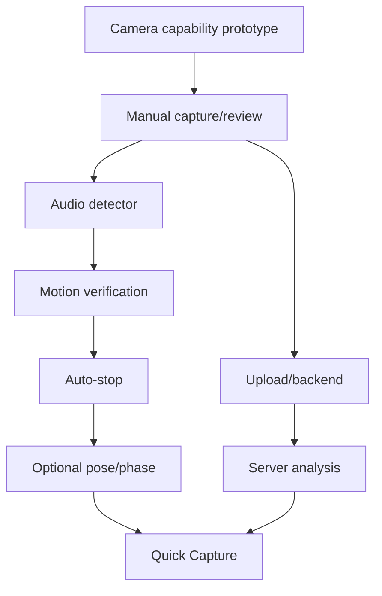

# 10. Implementation Roadmap

## Phase 0: Instrumented Camera Prototype

### Goal
Prove high-speed capture modes and device behavior before building ML.

Build:

- camera preview
- capability enumeration
- 240/120/60 FPS mode selection
- 20-second manual capture
- source metadata logging
- playback
- local file-size reporting

Acceptance:

- identify supported mode matrix on target devices
- confirm actual FPS/stability
- quantify bitrate/file sizes
- thermal soak data exists

Do this first. Camera limitations should shape the rest of implementation.

---

## Phase 1: Manual UX With Fixed Six-Second Review

Build:

- delay countdown
- start/stop/warning sounds
- 20 sec timeout
- manual Stop
- review screen
- auto-loop selected 6 sec
- large filmstrip
- fixed-width drag selection
- Save/Delete/Undo
- local trim on Save

Use manually chosen/default center before detector exists.

Acceptance:

- complete capture -> review -> save works offline
- no media loss
- filmstrip feels good one-handed
- export succeeds on target devices

---

## Phase 2: Audio Impact Candidate

Build:

- native audio tap
- onset detector
- known app-tone suppression
- impact-candidate timestamps
- candidate markers
- choose best candidate
- auto-center six-second review

Do not auto-stop yet.

Acceptance:

- gather labeled data
- measure candidate timing
- quantify adjacent-golfer false positives
- review always remains recoverable

---

## Phase 3: Motion Ownership Verification

Build:

- low-rate motion history
- golfer/body ROI
- fuse visual activity around audio candidate
- reject obvious nearby impacts
- telemetry

Still require review.

Acceptance:

- meaningful reduction in wrong-candidate rate
- negligible impact on high-FPS recording stability
- detector thermal cost acceptable

---

## Phase 4: Auto-Stop

Enable behind feature flag.

Behavior:

- high-confidence candidate
- continue 3 sec
- auto-stop
- completion tone
- review

Fallback:
- 17 sec warning
- 20 sec impact cutoff
- post-roll extension if impact occurs late

Acceptance:

- extremely low premature-stop rate
- no clipped follow-through
- users prefer it in pilot

---

## Phase 5: Direct Upload + Backend Processing

Build:

- Swing create API
- signed upload
- persistent upload queue
- S3
- SQS
- worker
- poster
- media validation
- analysis state
- private playback URL

Acceptance:

- offline Save
- upload restart recovery
- duplicate event safe
- queue retry safe
- source not deleted too early

---

## Phase 6: Pose / Temporal Verification

Only add if data shows audio+motion is insufficient.

Build one at a time:

- pose around candidate
- swing phase consistency
- optional ball disappearance
- learned fusion model

Measure incremental benefit versus:
- CPU
- battery
- thermal
- complexity
- latency

Do not add CV merely because it is technically impressive.

---

## Phase 7: Server High-FPS Analysis

Use all saved high-FPS frames for:

- refined impact
- swing phases
- pose
- club/shaft tracking
- biomechanics
- scores
- overlays

This is separate from capture detection.

---

## Phase 8: Quick Capture / Range Mode

After detector quality is proven:

- session mode
- repeated auto-detected swings
- auto-save or batch review
- encoded rolling buffer if appropriate
- background upload
- minimal walking back to phone

This can become a major UX differentiator.

---

## Workstream Dependencies

---

## Suggested Engineering Epics

### Epic A: Capture Core
- device capability enumeration
- recording
- timeouts
- audio
- source persistence

### Epic B: Review
- player
- 6-second loop
- thumbnails
- scrubber
- Save/Delete

### Epic C: Edge Detector
- onset
- classifier
- motion
- fusion
- telemetry

### Epic D: Media
- export
- poster
- cleanup
- codecs

### Epic E: Upload
- signed URL
- background queue
- retry/resume

### Epic F: Backend
- DB
- storage
- queue
- worker
- status

### Epic G: Analysis
- high-FPS models
- overlays
- metrics

### Epic H: Quality
- device farm
- labeled dataset
- telemetry dashboards
- model calibration

---

## V1 Definition of Done

A golfer can:

1. open camera
2. choose/use remembered delay
3. tap Record
4. hear/see recording start
5. walk to ball
6. take practice swing if desired
7. hit a shot
8. app identifies best candidate
9. app ends after post-roll or timeout
10. review immediately loops six seconds
11. golfer can move large thumbnail strip
12. golfer can Save or Delete
13. Save transitions immediately
14. clip exports locally
15. clip uploads reliably
16. server processes it
17. analysis appears
18. source is not lost under ordinary failures

And engineering can answer:

- what FPS was actually recorded?
- what detector version selected impact?
- how confident was it?
- did the user move the selection?
- how many bytes were uploaded?
- how long did analysis take?
