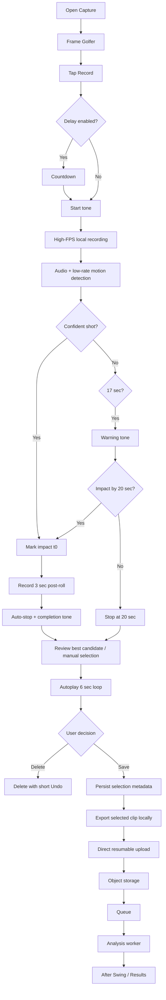
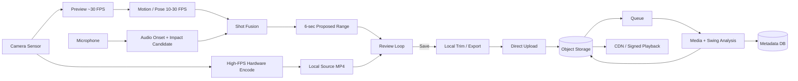
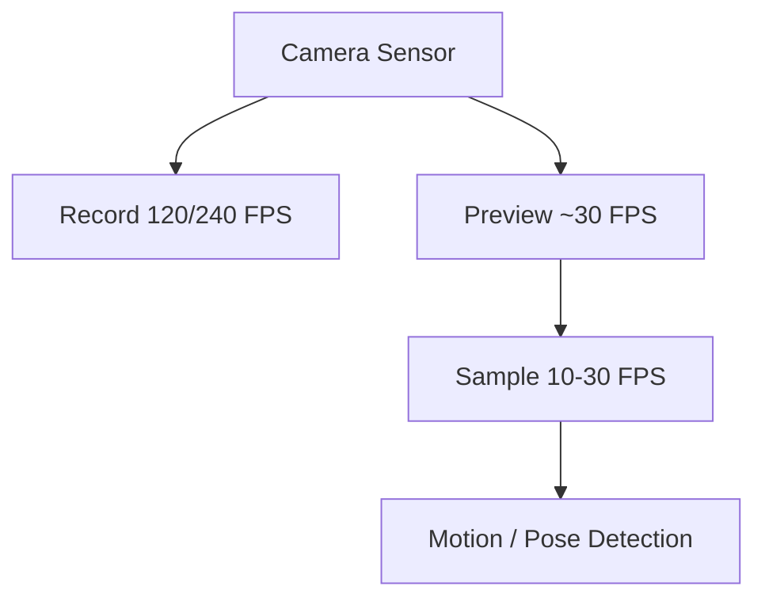
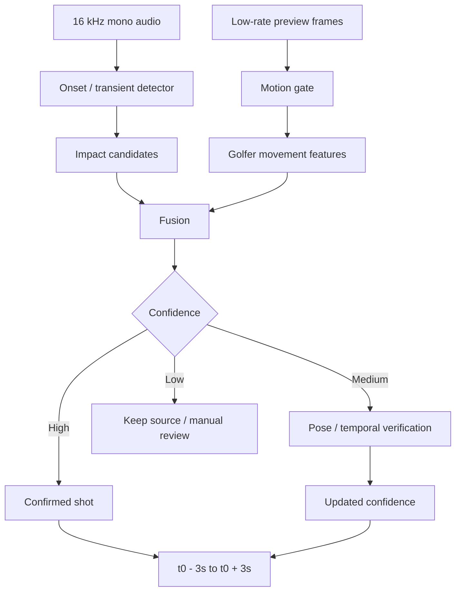
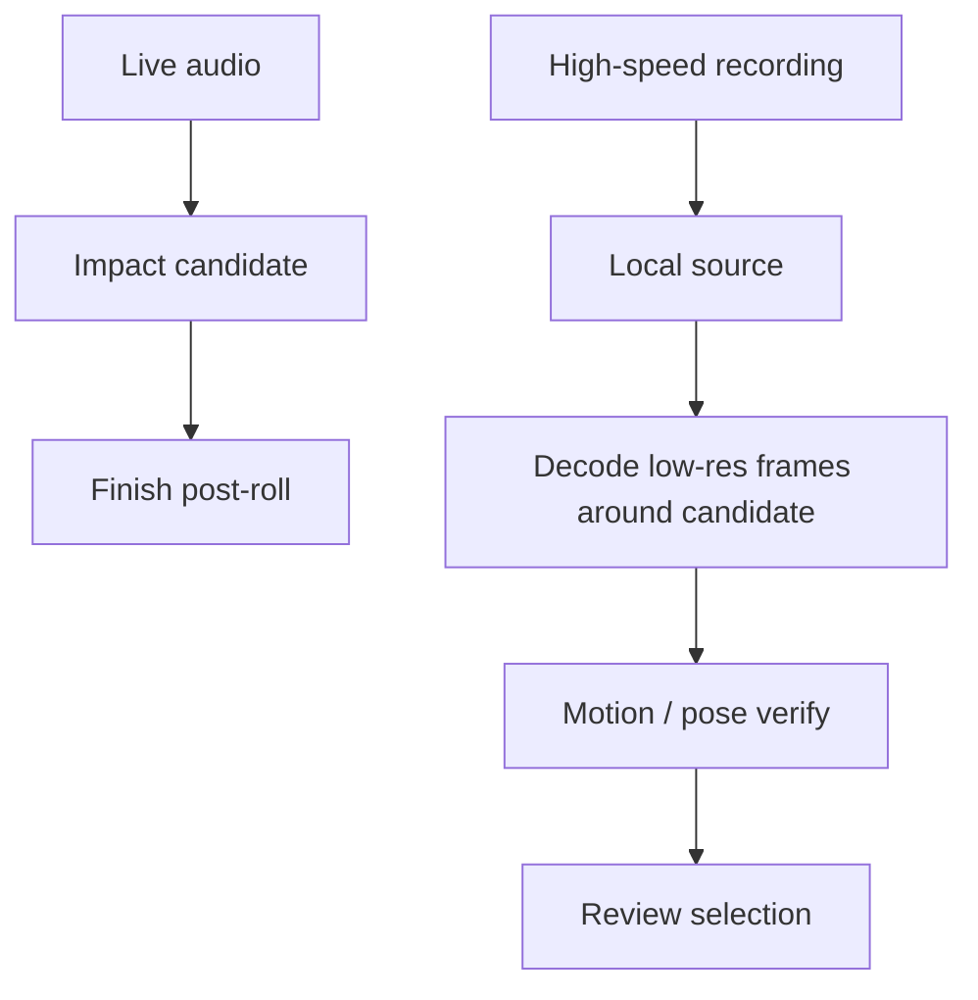
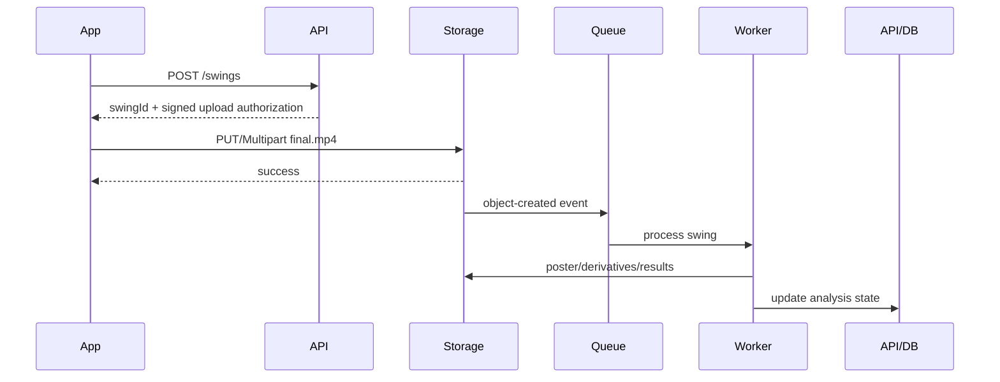
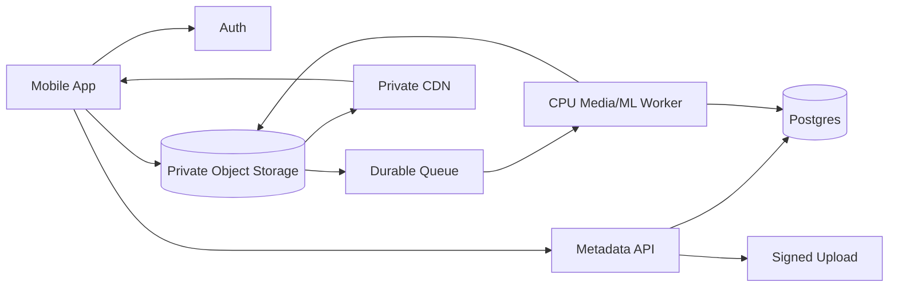
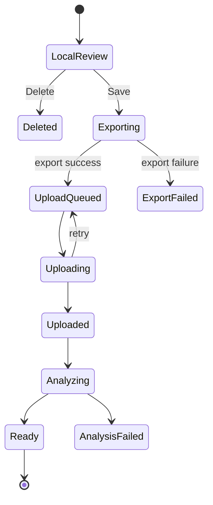
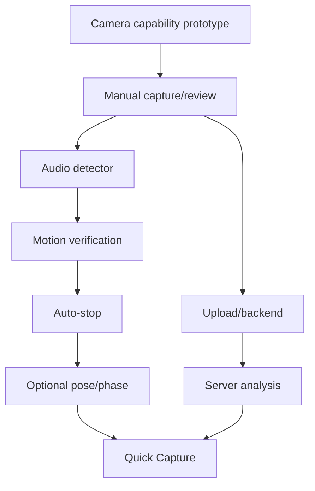

# Golf Swing Capture System - Full Consolidated Specification


---

<!-- BEGIN 00_README.md -->

# Golf Swing Capture, Detection, Review, Upload, and Analysis
## Engineering + Product Handoff Package

**Status:** Planning specification  
**Target:** React Native mobile app, iOS + Android  
**Primary use case:** A golfer places a phone, records one swing at high frame rate, the app automatically finds the actual shot, proposes a 6-second clip centered around impact, the golfer verifies it, then the app trims/uploads/analyzes it.  
**Baseline scale:** 1,000 users, 1 saved swing per user per day, approximately 30,000 saved swings/month.

---

## 1. Canonical Product Decisions

These are the current recommended decisions unless later testing disproves them.

1. **Record locally at the highest useful high-speed format the device can sustain.**
   - Prefer high FPS over 4K resolution for swing analysis.
   - Typical target hierarchy: 1080p240 -> 1080p120 -> 1080p60.
   - Allow device-specific alternatives such as 720p240 if that is the best stable high-FPS mode.
   - "Highest useful" means stable recording, acceptable exposure, acceptable file size, and no dropped frames.

2. **Do not run AI at recording FPS.**
   - Capture can be 120/240 FPS.
   - Preview may be around 30 FPS.
   - Motion/pose detection may inspect only 10-30 FPS.
   - Audio runs continuously and provides the most precise initial impact candidate.

3. **Separate three problems:**
   - Did the golfer perform a swing?
   - Did contact/impact occur?
   - What exact clip should be retained?

4. **Use an edge-first hybrid detector.**
   - Audio transient/onset detection identifies impact candidates.
   - Lightweight body movement verifies that the golfer is swinging.
   - Pose/temporal verification runs only when helpful.
   - Ball disappearance can be an optional confidence signal.
   - Server analysis can refine the exact impact and swing phases later.

5. **User verification is required in V1.**
   - The proposed swing immediately loops.
   - Default retained clip is exactly 6 seconds: 3 seconds before predicted impact + 3 seconds after.
   - The golfer can move a large filmstrip selection left/right.
   - The golfer presses Save or Delete.
   - This creates excellent correction/training data.

6. **Auto-stop after a confident shot.**
   - Once impact is confidently detected, retain 3 seconds post-impact and automatically stop.
   - The user can still manually stop.
   - If no shot is detected, warn near 17 seconds and end the shot-detection window at 20 seconds.
   - If impact happens near 20 seconds, allow the recording to continue up to 3 additional seconds so the follow-through is not cut off.

7. **Do not physically trim while the golfer is scrubbing.**
   - Review playback uses the original local recording with `selectionStart` and `selectionEnd`.
   - Export the 6-second derivative only after Save.

8. **Upload directly from device to object storage.**
   - Do not proxy video bytes through the API server.
   - API issues an upload authorization / signed URL.
   - Phone uploads directly to S3-compatible object storage.
   - Object-created event -> queue -> worker -> analysis.

9. **Store final clips as MP4 and serve with byte-range requests/CDN.**
   - HLS is unnecessary for a normal 6-second private clip at initial scale.
   - Add HLS/ABR only if longer video, public sharing, repeated coach viewing, or network adaptation makes it necessary.

10. **Keep the original source only as long as necessary.**
    - Local source remains until trim/export succeeds and server acceptance is confirmed.
    - Normally upload only the selected clip.
    - Low-confidence or failed-trim workflows may retain/upload a larger source temporarily.
    - Never silently lose the only copy of a swing.

---

## 2. Document Map

| File | Purpose |
|---|---|
| `01_PRODUCT_UX_SPEC.md` | Complete golfer journey, recording UX, review UI, sounds, scrubber, Save/Delete, edge cases |
| `02_CAPTURE_RECORDING_SPEC.md` | High-FPS camera requirements, device capability tiers, codecs, timestamps, local storage, file sizes |
| `03_SWING_DETECTION_TRIMMING.md` | Audio + motion + pose architecture, practice swing rejection, confidence model, pseudocode |
| `04_MEDIA_PIPELINE_PLAYBACK.md` | Review-loop implementation, thumbnails, local export, MP4, upload, playback/CDN |
| `05_BACKEND_CLOUD_ARCHITECTURE.md` | Cloud topology, queues, storage, workers, security, retention, scaling |
| `06_DATA_MODEL_API_CONTRACTS.md` | Database entities, fields, enums, APIs, state machines, idempotency |
| `07_MOBILE_IMPLEMENTATION_NOTES.md` | React Native/native boundaries, iOS/Android implementation guidance, background work |
| `08_TESTING_OBSERVABILITY_ML_FEEDBACK.md` | Test matrix, ground truth, telemetry, quality gates, thermal/performance testing |
| `09_COST_CAPACITY_MODEL.md` | 1k/day cost model and 10x/100x considerations |
| `10_IMPLEMENTATION_ROADMAP.md` | Recommended development sequence and acceptance criteria |
| `11_DECISIONS_OPEN_QUESTIONS.md` | Decision log and unresolved choices |
| `12_AI_CODER_MASTER_PROMPT.md` | Ready-to-use prompt for an AI coding/planning agent |
| `FULL_SPEC.md` | Concatenated version of the package |

---

## 3. Primary End-to-End Flow



---

## 4. Architecture at a Glance



---

## 5. Important Product Philosophy

The capture detector should not be thought of as "detect the sound of a golf ball."

It should be thought of as:

> **Detect that this golfer performed a golf swing, and establish evidence that contact occurred near a particular moment.**

Each signal answers a different question:

- **Audio:** when did a sharp impact-like event occur?
- **Motion/pose:** was the golfer actually swinging at that time?
- **Ball state:** did the ball likely leave the hitting area?
- **Temporal swing model:** does the motion sequence make sense as a golf swing?
- **User correction:** did the app choose the right swing?
- **Server high-FPS analysis:** what is the best final impact frame and phase timing?

The highest priority is **never losing a valid swing**. False positives are inconvenient. A false negative that discards the golfer's only swing is much worse.

---

## 6. Implementation Principle

Treat these documents as the product/architecture contract, not as an instruction to build everything at once.

Recommended V1:

- high-FPS local recording
- audio transient detector
- lightweight user-motion verification
- impact candidate
- 6-second review loop
- large thumbnail filmstrip
- Save/Delete
- local export
- direct object-storage upload
- server analysis
- telemetry recording the predicted and user-corrected ranges

Add heavier pose/ball/phase models only if real-world data shows they are needed.


<!-- END 00_README.md -->


---

<!-- BEGIN 01_PRODUCT_UX_SPEC.md -->

# 01. Product and UX Specification

## 1. Product Goal

Make recording a golf swing feel like this:

> Tap Record -> hit the ball -> hear that the app got it -> walk back -> glance at the correct looping swing -> Save.

The app should do most of the work while preserving user control before upload.

The UI should minimize setup, prevent accidental loss, and remain usable outside in bright light while the phone is several feet away.

---

## 2. Primary User Journey

### 2.1 Ready / Camera Screen

The camera preview is active.

Primary control:

- **Record**

Secondary settings, remembered between sessions:

- Delay: Off / 3 sec / 5 sec / 10 sec
- Capture quality: Auto / optional advanced override
- Sound cues: On / Off
- Camera: Front / Rear
- View label: Face-on / Down-the-line / Unknown, if used by the larger product

Recommended default: **Auto high-speed capture**.

The app should query the device and choose the highest useful supported recording format.

### 2.2 Tap Record

If delay is Off:

1. User taps Record.
2. Start tone plays.
3. Recording begins.

If delay is enabled:

1. User taps Record.
2. Countdown begins.
3. For a short delay, show visual countdown.
4. Only beep for the final three seconds:
   - 3: beep
   - 2: beep
   - 1: beep
5. Start tone plays.
6. Recording begins.

Do not beep ten times for a ten-second delay.

**Technical note:** because the app generated the countdown/start tones, their timestamps are known. The audio detector should suppress/ignore windows around these tones.

---

## 3. Recording State UX

### 3.1 Visual State

During capture, make the screen extremely simple.

Recommended elements:

- large red recording indicator
- large elapsed timer
- clear manual Stop control
- optional subtle "Listening for swing" status
- no distracting analytics

Example:

```text
┌──────────────────────────────────┐
│                                  │
│                                  │
│          CAMERA PREVIEW          │
│                                  │
│                                  │
│                                  │
│                                  │
│            ●  08                 │
│          RECORDING               │
│                                  │
│             STOP                 │
└──────────────────────────────────┘
```

The user may be too far away to read fine text. Use strong visual state, large targets, and sounds/haptics.

### 3.2 What Happens Internally

While recording:

- full high-FPS video is hardware-encoded locally
- audio is recorded
- cheap audio onset detection is active
- low-rate visual movement/pose signals may be evaluated
- candidate impacts are timestamped
- the original recording remains intact until the user saves/deletes

The user should not see ML implementation details.

---

## 4. Automatic Stop Behavior

### 4.1 Preferred Behavior

When the app detects a high-confidence actual shot:

1. Record `impactTime`.
2. Continue recording for **3.0 seconds**.
3. Stop automatically.
4. Play a distinctive completion/end tone.
5. Open Swing Review.

This means the golfer normally does **not** walk back and press Stop.

### 4.2 Manual Stop

Manual Stop remains available.

If the user presses it:

- play stop tone
- finalize the local source
- select the best detected candidate if one exists
- otherwise open Review in manual-selection mode

### 4.3 Twenty-Second Detection Window

Use 20 seconds as the maximum time to **find an impact**, not necessarily the absolute maximum file duration.

Recommended behavior:

- 0 sec: capture begins
- 17 sec: warning tone if no shot has been confirmed
- 20 sec: if no shot, stop
- if impact occurs at 19.2 sec, allow recording through 22.2 sec to preserve the required 3 sec post-roll

Thus maximum normal duration can be approximately 23 seconds.

### 4.4 Warning Tone

At about 17 seconds, use a short warning distinct from countdown and stop tones.

Purpose:

> "You have about three seconds remaining before the app ends this attempt."

Do not use speech unless usability testing shows it helps.

---

## 5. Swing Review Screen

### 5.1 Purpose

The review screen answers only:

> **Did the app capture and select the correct swing?**

It is not the final swing-analysis experience.

### 5.2 Default Selection

If predicted impact is `t0`:

- `selectionStart = t0 - 3.0 sec`
- `selectionEnd = t0 + 3.0 sec`
- duration = 6.0 sec

Clamp the range against actual recording boundaries only when necessary.

### 5.3 Autoplay

Immediately autoplay the selected 6-second section in a loop.

Default playback speed: **1x**.

Optional controls:

- 1x
- 0.5x
- 0.25x
- Play/Pause

Do not make slow motion the default. The review decision is "right swing or wrong swing," not detailed analysis.

### 5.4 Impact Indicator

Show a visible impact marker inside the selected region.

Do not require the golfer to identify an exact impact frame.

The server/high-FPS analysis can later refine the exact frame.

### 5.5 Large Filmstrip Scrubber

Use a large thumbnail filmstrip, approximately 70-90 logical pixels high or otherwise clearly thumb-friendly.

Example:

```text
FULL SOURCE

0 sec                                                20 sec
│                                                       │
┌────┬────┬────┬────┬────┬────┬────┬────┬────┬────┐
│img │img │img │img │img │img │img │img │img │img │
└────┴────┴────┴────┴────┴────┴────┴────┴────┴────┘
          ░░░┌──────────────────┐░░░░░░░░░░
             │ SELECTED 6 SEC   │
             └────────▲─────────┘
                      │
                   IMPACT
```

The selected region is fully visible. Unselected content is dimmed.

### 5.6 Fixed-Width Selection

Preferred interaction:

- the retained clip is always 6 seconds
- the golfer drags the filmstrip or selection left/right
- selection width stays fixed
- no tiny independent start/end handles in the primary flow

This reduces the action from "choose a start and an end" to "move the six-second window to the correct swing."

### 5.7 Candidate Markers

If multiple possible swing/impact events were detected, show subtle candidate markers.

Example:

```text
0                                                20
|-------------------------------------------------|
          •                ●
       candidate         selected
```

Possible interaction:

- tapping a candidate recenters the 6-second window on it
- selected candidate has stronger visual treatment
- do not overload the timeline with probabilities/numbers

This is useful when the golfer takes a practice swing.

---

## 6. Review Actions

### 6.1 Save

Save should be the dominant action.

Recommended:

- large right-side button
- green or brand-positive success treatment
- label: **Save**

On tap:

1. freeze/persist the user's selection
2. transition immediately to the After Swing page
3. begin local export and upload
4. show analysis/upload progress in the destination experience, not a blocking modal

### 6.2 Delete

Delete is secondary but obvious.

Recommended:

- round red trash button on left
- avoid a blocking confirmation in normal range use
- after delete, show a short Undo opportunity

Do not physically erase the only source until the Undo period expires.

### 6.3 Save Should Feel Instant

Do not hold the golfer on a modal that says:

- Processing
- Trimming
- Uploading 47%

Instead:

```text
Save
  |
  +--> transition to After Swing
  |
  +--> export clip
  |
  +--> upload
  |
  +--> analysis
```

The next page can say:

> Swing saved  
> Analyzing...

---

## 7. Review State Wireframe

```text
┌─────────────────────────────────────┐
│                                     │
│                                     │
│            SWING VIDEO              │
│                                     │
│                ▶                    │
│                                     │
│                                     │
├─────────────────────────────────────┤
│          Swing detected             │
│                                     │
│   0:09                        0:15   │
│                                     │
│ ┌────┬────┬────┬────┬────┬──────┐ │
│ │img │img │img │img │img │img   │ │
│ └────┴────┴──▲─┴────┴────┴──────┘ │
│              │                      │
│           IMPACT                    │
│                                     │
│       Drag to select your swing     │
│                                     │
│   [ trash ]            [ ✓ SAVE ]   │
│                                     │
└─────────────────────────────────────┘
```

---

## 8. If Detection Is Wrong

Do not build a separate "AI was wrong" workflow.

The filmstrip itself is the correction interface.

Example:

- app selected practice swing at 6 sec
- real shot occurred at 14 sec
- golfer drags six-second selection to 14 sec
- Save

Store both the predicted and corrected values as training data.

---

## 9. If Detection Finds Nothing

If no reliable impact candidate exists:

- stop normally at timeout or manual Stop
- show entire source filmstrip
- place selection around the strongest available candidate if any
- otherwise choose a neutral range and explain concisely:
  - "We couldn't confidently find impact. Slide to your swing."

The source must remain available.

Never auto-delete because detection failed.

---

## 10. Practice Swing UX

Ideal detector behavior:

- visual swing + no impact = likely practice swing
- impact-like audio + no user swing = likely nearby golfer/noise
- visual swing + impact = actual shot

If multiple events remain plausible:

- pick highest confidence
- show other candidate markers
- golfer can correct in one swipe/tap

---

## 11. Offline and Weak-Network UX

Recording and review must work without internet.

On Save:

- create/export locally
- queue upload
- show locally as Saved/Pending Upload
- automatically retry when connection permits
- allow user to record another swing immediately

Never make network availability a prerequisite for capture.

---

## 12. Sounds and Haptics

Suggested distinct sound vocabulary:

| Event | Sound |
|---|---|
| countdown final 3 sec | short beep |
| recording begins | unique start tone |
| 17-sec warning | short warning tone |
| successful shot + post-roll completed | completion/stop tone |
| manual stop | same or related stop tone |
| save | optional subtle haptic |
| delete | optional warning haptic |

Requirements:

- sounds must be distinguishable at outdoor/range volume
- sounds generated by app must be excluded from impact detection windows
- provide a mute/sound-cues setting
- visual status must remain sufficient if phone is muted or user cannot hear the cues

---

## 13. Future "Quick Capture / Range Mode"

Do not make this the V1 default.

Future mode:

1. user starts a session
2. app keeps a local rolling encoded buffer / capture workflow
3. shot detected
4. clip auto-saved
5. app returns to ready state for the next shot
6. review becomes optional or batch-based

Only enable after false-negative/false-positive rates are proven.

V1 user verification is valuable for quality and model training.

---

## 14. UX Success Metrics

Track:

- percentage of recordings where initial 6-second selection is saved without adjustment
- manual trim adjustment rate
- amount of adjustment in milliseconds
- wrong-practice-swing selection rate
- no-candidate rate
- manual Stop rate
- auto-stop success rate
- Delete rate
- Undo-delete rate
- time from Record to impact
- time from impact to Review
- time on Review before Save
- upload retry rate
- percentage of users who save another swing in the same session
- device-specific crash/thermal failure rate

A strong quality indicator is:

> **% of saved swings requiring zero timeline adjustment**

---

## 15. Accessibility and Outdoor Use

- large touch targets
- high contrast
- sunlight-readable recording state
- do not rely only on red/green color
- haptics where appropriate
- screen-reader labels for controls
- persistent visual state for users who cannot hear beeps
- prevent screen sleep during active capture/review
- clear permission recovery for camera/microphone

---

## 16. Product Copy Suggestions

Keep copy functional and short.

Recording:
- `Recording`
- `Stop`

Review:
- `Swing detected`
- `Drag to select your swing`
- `Save`
- `Delete`

Low confidence:
- `Check your swing`
- `We weren't fully sure which swing was yours. Slide to adjust.`

After save:
- `Swing saved`
- `Analyzing your swing...`


<!-- END 01_PRODUCT_UX_SPEC.md -->


---

<!-- BEGIN 02_CAPTURE_RECORDING_SPEC.md -->

# 02. Capture and Recording Specification

## 1. Core Requirement

Capture golf swings at the **highest useful frame rate supported by the phone**, while keeping resolution and bitrate reasonable enough for:

- local temporary recording
- rapid review
- 6-second final clip export
- cellular upload
- downstream swing analysis

High FPS is central because a golf swing changes very quickly around transition and impact.

---

## 2. Capture FPS Is Not Detection FPS

These are separate pipelines.



Example:

- recording: 240 FPS
- preview: 30 FPS
- body detector: 15-20 FPS
- server analysis after save: all 240 FPS frames if needed

The detector does not need every recorded frame to determine whether the golfer's body is executing a swing.

---

## 3. Device Capability Discovery

Never hard-code 240 FPS.

At runtime, inspect:

- available cameras
- supported resolutions
- supported high-speed FPS ranges
- codec availability
- hardware encoding support
- preview limitations
- whether analysis/frame processor can coexist with high-speed video
- device thermal/performance history if collected

Create a normalized capability object.

Example:

```ts
type CaptureCapability = {
  cameraId: string
  lens: 'wide' | 'ultrawide' | 'telephoto' | 'front' | 'unknown'
  width: number
  height: number
  minFps: number
  maxFps: number
  codecs: Array<'h264' | 'hevc'>
  highSpeed: boolean
  previewSupported: boolean
  concurrentAnalysisSupported: boolean
}
```

---

## 4. Recommended Quality Selection Policy

Initial policy:

1. prefer 240 FPS if stable and enough resolution is available
2. otherwise 120 FPS
3. otherwise 60 FPS
4. avoid sacrificing so much exposure or resolution that body/club features become unusable

Suggested priority candidates:

| Priority | Example mode | Notes |
|---|---|---|
| 1 | 1080p240 | Excellent timing when supported and lighting is adequate |
| 2 | 1080p120 | Strong default high-speed target |
| 3 | 720p240 | Consider when 1080p240 unavailable and temporal detail matters more |
| 4 | 1080p60 | Broad fallback |
| 5 | device best | Last-resort compatible mode |

Do not blindly choose the numerically highest FPS if it requires a poor lens, unusable exposure, severe crop, or unstable encoder.

Expose advanced override later, not necessarily V1.

---

## 5. Resolution Tradeoff

The user requirement favors high FPS and controlled file size.

General guidance:

- 1080p is a strong target for golfer/body analysis
- 720p can be acceptable for impact timing/body pose if it enables substantially higher FPS
- 4K is usually less valuable than 120/240 FPS for this use case
- exact club-face analysis may ultimately depend on distance, shutter, lens, lighting, and club pixel size more than raw resolution alone

Use real captured datasets to decide whether 720p240 or 1080p120 produces better downstream model performance on each device family.

---

## 6. Shutter, Exposure, and Lighting

High FPS requires shorter frame intervals and generally more light.

Important:

- outdoor daylight is favorable
- dim indoor simulator environments may force high ISO/noise
- motion blur can still make the club difficult to track even at high FPS if shutter time is long
- FPS and shutter speed are different concepts

If manual controls are available and product testing supports them, consider:

- biasing toward faster shutter for club/body edge clarity
- locking focus after framing
- locking or stabilizing exposure/white balance once capture begins

Avoid an expert-camera setup experience for normal users. Automate this.

---

## 7. Stabilization and Geometric Analysis

The phone is normally fixed on a tripod or support.

For biomechanical analysis, a stable field of view is desirable.

Consider disabling digital stabilization if it:

- introduces crop changes
- warps geometry
- is unsupported in high-speed mode
- causes frame-to-frame transformations that complicate pose/club measurements

This must be device-tested rather than assumed.

---

## 8. Orientation

Lock capture orientation once recording begins.

Store:

- physical device orientation
- rendered rotation
- camera lens
- front/rear camera
- mirror state
- view type if known

Do not let orientation changes mid-swing alter encoded geometry.

---

## 9. Audio

Capture audio with the source video unless privacy/product requirements say otherwise.

For detection, independently downsample/process a cheap mono stream, e.g.:

- 16 kHz
- mono
- short frames
- onset/transient analysis

The final stored derivative may optionally have audio removed after detection if the product does not need it.

That can improve privacy when conversations occur at a golf range.

---

## 10. Temporary Source Duration

Normal maximum:

- up to 20 seconds waiting for impact
- plus up to 3 seconds post-impact
- approximately 23 seconds absolute normal maximum

If user manually stops earlier, use that duration.

---

## 11. Example Temporary File Sizes

Actual phone encoders vary significantly. Treat bitrate as measured input, not a constant.

Formula:

```text
size_MB ~= bitrate_Mbps * duration_seconds / 8
```

For a 23-second temporary source:

| Bitrate | Approx source size |
|---:|---:|
| 10 Mbps | 28.8 MB |
| 20 Mbps | 57.5 MB |
| 40 Mbps | 115 MB |
| 80 Mbps | 230 MB |

For a 6-second saved clip:

| Bitrate | Approx final size |
|---:|---:|
| 10 Mbps | 7.5 MB |
| 20 Mbps | 15 MB |
| 40 Mbps | 30 MB |
| 80 Mbps | 60 MB |

This is why **local trimming before upload** is important even though cloud storage itself is inexpensive.

---

## 12. Local Source Storage

Use application-private temporary storage.

Requirements:

- source survives transition to Review
- source survives a recoverable app interruption if practical
- source is not deleted until:
  1. user deletes and Undo expires, or
  2. saved derivative exports successfully and server acceptance policy is satisfied
- orphaned temp files are cleaned by a maintenance job

Suggested states:

```text
recording
finalizing
reviewable
exporting
queued_for_upload
uploaded
safe_to_delete_source
deleted
```

---

## 13. Encoded Ring Buffer: Future Range Mode

For future hands-free range mode, avoid retaining uncompressed frames.

Use a rolling sequence of encoded fragments/segments:

- retain recent N seconds on disk/cache
- overwrite old fragments
- when impact occurs, preserve pre-roll fragments
- capture post-roll
- stitch/export the selected clip

This is much more memory-efficient than storing raw 240 FPS frames.

---

## 14. Codec

### H.264

Pros:
- universal playback
- broad tooling
- simple web/client compatibility

Cons:
- larger files at equivalent quality

### HEVC/H.265

Pros:
- smaller file for similar quality
- useful for high-FPS local storage

Cons:
- compatibility/tooling/licensing considerations
- server analysis stack must support it
- some browser environments are less predictable

Recommendation:

- support source codec chosen by device/hardware
- normalize only when downstream analysis/serving requires it
- do not transcode merely for architectural neatness

---

## 15. Keyframes / GOP

If encoder control allows it, a moderate keyframe interval such as ~0.5-1 second can improve fast trimming/seeking without forcing all-intra encoding.

Tradeoff:

- more frequent keyframes: easier cuts/seeks, larger file
- longer GOP: smaller file, more re-encode may be needed around cut points

Measure on actual hardware.

---

## 16. Timestamps

Accurate timestamps matter more than wall-clock time.

Store monotonic media-time values for:

- recording start
- detector sample timestamps
- each impact candidate
- selected impact
- selection start/end
- manual correction
- encoding completion

Do not rely on JavaScript `Date.now()` as the sole frame/impact alignment mechanism.

Native media presentation timestamps should be the source of truth.

---

## 17. Android High-Speed Constraints

Modern CameraX supports high-speed recording, commonly 120/240 FPS, but high-speed sessions have stricter combinations than normal camera sessions.

Important current Android behavior:

- high-speed recording is a special constrained mode
- preview may be present but normally runs at a lower rate than the recording stream
- not every normal CameraX use case/effect is available in high-speed mode
- device-supported high-speed capabilities must be queried

Design consequence:

> The app must support devices where high-speed recording and a normal CPU image-analysis stream cannot run together.

Fallback:

1. record high-speed video
2. run continuous audio detection
3. use available preview/motion data if supported
4. after candidate/stop, locally inspect a short decoded video interval to verify swing motion

This preserves high-FPS recording even on constrained hardware.

---

## 18. iOS High-Speed Constraints

Use AVFoundation-native format discovery.

Select an `AVCaptureDeviceFormat` with a supported high frame-rate range and configure the device accordingly.

As with Android:

- choose supported format, not an assumed one
- keep real-time processing lighter than recording
- avoid blocking the capture queue
- drop analysis frames if analysis is behind rather than harming the recording

---

## 19. Capture Failure Handling

Examples:

### Not enough storage
Before starting:
- estimate a safe temporary-space requirement
- block capture with clear recovery if insufficient

### Thermal pressure
- detect/observe thermal state where possible
- gracefully fall back to lower FPS if required
- record telemetry about selected mode and fallback

### Encoder/camera failure
- surface a concise retry
- retain already finalized source when possible

### Incoming call/app background
- capture APIs may be interrupted
- finalize or mark attempt interrupted
- never pretend a complete swing was saved when the media is incomplete

---

## 20. External Technical References

- Android CameraX high-speed video API: https://developer.android.com/reference/androidx/camera/video/HighSpeedVideoSessionConfig
- Android CameraX releases / high-speed support: https://developer.android.com/jetpack/androidx/releases/camera
- Android CameraX architecture: https://developer.android.com/media/camera/camerax/architecture
- Apple AVFoundation capture documentation: https://developer.apple.com/av-foundation/


<!-- END 02_CAPTURE_RECORDING_SPEC.md -->


---

<!-- BEGIN 03_SWING_DETECTION_TRIMMING.md -->

# 03. Swing Detection and Trimming

## 1. Goal

Automatically propose the **actual hit**, not a practice swing, using the cheapest reliable on-device signals.

The detector does not need to perfectly classify biomechanics. It must:

1. identify likely contact time
2. verify that the phone's golfer was performing a swing around that time
3. reject nearby impacts/noise when possible
4. choose the best candidate
5. produce a proposed 6-second window
6. never destroy the source if uncertain

---

## 2. Decompose the Problem

### Impact detection
"When did something impact?"

Best first signal: audio transient.

### Swing detection
"Was the golfer on camera actually swinging?"

Signals:
- body motion
- pose landmark motion
- temporal pattern

### Ownership
"Was that impact caused by our golfer rather than someone nearby?"

Signals:
- user swing overlaps impact
- body/hand velocity peaks near impact
- tracked person identity/location
- optional ball disappearance
- phase consistency

### Trimming
"What six seconds should the user review/save?"

Default:
- 3 sec before impact
- 3 sec after impact

---

## 3. Recommended Edge Pipeline



---

## 4. Audio Onset Detection

Do not use a simple amplitude threshold.

Use onset-detection concepts such as:

- spectral flux
- high-frequency content
- complex-domain onset
- adaptive local noise floor
- peak picking
- refractory/debounce interval

Golf impact is a transient event.

A basic process:

```text
audio frames
  -> frequency-domain / onset feature
  -> adaptive normalization
  -> candidate peak detection
  -> short candidate window
  -> golf-impact classifier
```

The detector is cheap enough to run continuously during a short capture.

---

## 5. Impact Classifier

A custom classifier should learn hard negatives, not only "golf vs silence."

Suggested classes:

- golf_ball_impact
- club_ground_impact
- club_mat_impact
- simulator_screen_impact
- nearby_golf_shot
- bucket/club clank
- clap
- speech transient
- other_transient

For an MVP, pretrained audio embeddings such as YAMNet can be used to prototype a classifier. Production should likely move toward a smaller task-specific model after enough labeled data exists.

Candidate audio window can be short, e.g. roughly:

- -300 ms before onset
- +400 ms after onset

Exact values should be tuned.

---

## 6. Why Audio Should Not Act Alone

At a driving range:

- adjacent golfers hit balls
- clubs hit mats
- buckets clank
- carts and voices create transients

Therefore:

```text
impact-like sound
        +
our golfer was executing a swing
        =
much stronger shot evidence
```

---

## 7. Cheap Motion Gate

Before running expensive pose inference, use inexpensive visual evidence.

Possible methods:

- frame differencing
- downsampled optical flow
- foreground motion in a golfer ROI
- tracked person bounding-box movement
- hand/upper-body motion if landmarks already available

Input can be small, e.g. 256-512 px side.

Detection cadence can be ~10-30 FPS even when recording 120/240 FPS.

---

## 8. Pose Verification

When needed, use a pose model such as MediaPipe Pose Landmarker.

Useful landmarks/features:

- shoulders
- elbows
- wrists
- hips
- knees
- ankles

The goal is not perfect swing coaching here.

Useful real-time features:

- wrist speed
- hand path magnitude
- shoulder rotation proxy
- hip rotation proxy
- vertical/horizontal hand travel
- direction reversal near transition
- rapid downswing movement
- follow-through movement after candidate impact

Pose can verify a golf-like motion sequence around an audio candidate.

---

## 9. Temporal Phase Verification

GolfDB demonstrates that golf videos can be segmented into events including:

- address
- toe-up
- mid-backswing
- top
- mid-downswing
- impact
- mid-follow-through
- finish

A temporal model can eventually provide stronger swing-phase consistency.

Important caveat:

GolfDB contains swing-centric clips. Accuracy reported on that dataset should **not** be interpreted as equivalent performance on arbitrary 20-second phone recordings with walking, practice swings, adjacent golfers, and noise.

Use such a model as a reference architecture or downstream verifier, not a magical off-the-shelf solution.

---

## 10. Optional Ball Evidence

If the ball region can be found reliably:

- ball present before impact
- ball absent after impact

can provide a strong confidence increment.

Do not make this mandatory in V1 because:

- ball is tiny
- golfer/club may occlude it
- white ball/background contrast varies
- camera angle varies
- range mats and grass vary
- resolution/distance vary

Treat it as a verifier, not the only detector.

---

## 11. Practice Swing Rejection

Ideal signal matrix:

| Visual user swing | Impact audio | Interpretation |
|---|---|---|
| yes | yes | likely real shot |
| yes | no | likely practice swing |
| no | yes | likely nearby golfer/noise |
| no | no | no shot |
| yes | weak/ambiguous | run deeper verification |

A practice swing may still create club swish or mat contact, so the classifier and temporal evidence matter.

---

## 12. Nearby Golfer Rejection

Track the user's person/body region during recording.

For each audio candidate:

- was tracked golfer moving?
- did hand/wrist velocity peak near the candidate?
- was there a plausible backswing before?
- was there follow-through after?
- did optional ball state change?

An audio candidate without corresponding user motion should be heavily discounted.

---

## 13. Ground/Mat Strike Near Ball Impact

A golf shot can produce multiple closely spaced transients.

Do not assume the loudest peak is the ball.

Process a short cluster of peaks:

1. group peaks separated by a small threshold
2. classify each/combined acoustic shape
3. compare with predicted visual impact phase
4. choose candidate nearest the visual impact expectation
5. retain all raw candidates for telemetry

Tune thresholds empirically.

---

## 14. Illustrative Fusion Model

Example only:

```text
score =
  0.50 * audioImpactConfidence +
  0.30 * visualSwingConfidence +
  0.15 * phaseConsistency +
  0.05 * ballEvidence
```

Do not ship these exact weights merely because they appear here.

Train/calibrate with real captured data.

---

## 15. Confidence-Based Behavior

Suggested starting policy:

| Confidence | Behavior |
|---|---|
| >= 0.90 | auto-stop after +3 sec, propose 6 sec |
| 0.65-0.90 | stop normally, show review with candidate markers |
| < 0.65 | retain entire source and emphasize manual selection |

The exact thresholds require validation.

Product priority:

> False negatives that cause lost swings are worse than an occasional manual correction.

---

## 16. Multiple Candidate Selection

For each candidate `i`, keep:

```ts
type ShotCandidate = {
  timeSec: number
  audioScore: number
  visualSwingScore: number
  phaseScore?: number
  ballScore?: number
  fusedScore: number
  source: string[]
}
```

Choose max fused score as default.

Expose other candidates to review as subtle timeline markers.

---

## 17. High-FPS Recording With Low-Rate Detection

At 240 FPS, 15 FPS detection means approximately one analyzed frame out of every 16 recorded frames.

This is fine.

The local detector only needs to establish a broad temporal sequence around impact.

The high-FPS source is preserved for later precision analysis.

---

## 18. Constrained Device Fallback

Some high-speed camera modes will not permit the desired live image-analysis stream.

Fallback architecture:



Verification can happen after recording, locally, before Review or just after Review begins.

This is still a good UX because only a few seconds of video need to be sampled.

---

## 19. Pseudocode

```ts
onRecordingStarted() {
  candidates = []
  motionHistory.start()
  audioDetector.start()
}

onAudioOnset(onset) {
  if (isKnownAppSoundWindow(onset.time)) return

  const audio = impactClassifier.classify(onset.window)
  if (audio.score < AUDIO_MIN) return

  const motion = motionHistory.scoreWindow(
    onset.time - 1.5,
    onset.time + 0.8
  )

  let candidate = fuse(audio, motion)

  if (candidate.confidence >= HIGH_CONFIDENCE) {
    confirmShot(candidate)
  } else if (candidate.confidence >= MEDIUM_CONFIDENCE) {
    enqueuePoseVerification(candidate)
  } else {
    candidates.push(candidate)
  }
}

confirmShot(candidate) {
  selectedImpact = candidate.time
  scheduleStopAt(candidate.time + 3.0)
}

onRecordingFinalized(file) {
  const best = chooseBestCandidate(candidates, selectedImpact)

  if (best) {
    review.start = max(0, best.time - 3)
    review.end = min(file.duration, best.time + 3)
  } else {
    review = makeManualFallback(file)
  }

  openReview(file, review, candidates)
}
```

---

## 20. User Corrections as Training Data

Store:

- model-selected impact
- selected six-second start/end
- amount user shifted range
- whether user picked another candidate
- whether user deleted
- device/camera/FPS
- environmental tags if inferable
- detector/model versions

Do not automatically treat every Save as exact ground-truth impact.

But a large shift from the prediction is strong evidence of a wrong candidate.

A later server model can derive refined impact and compare it with edge prediction.

---

## 21. Dataset Requirements

Collect real-world examples across:

- driving range with adjacent golfers
- empty range
- golf course
- indoor simulator
- mat
- grass
- driver
- fairway woods
- irons
- wedges
- chips/partial shots
- fat shots
- thin shots
- topped shots
- misses
- practice swings
- left-handed and right-handed golfers
- face-on and down-the-line
- close/far framing
- bright sun
- shade
- dusk
- indoor dim light
- wind
- speech
- music
- carts
- club/bucket clanks

Label event-level truth.

Metrics:

- shot precision/recall
- impact timing error
- practice swing false-positive rate
- nearby-shot false-positive rate
- "valid swing lost" rate
- percent requiring user adjustment

---

## 22. External References

- GolfDB / SwingNet paper: https://openaccess.thecvf.com/content_CVPRW_2019/papers/CVSports/McNally_GolfDB_A_Video_Database_for_Golf_Swing_Sequencing_CVPRW_2019_paper.pdf
- MediaPipe Pose Landmarker: https://developers.google.com/edge/mediapipe/solutions/vision/pose_landmarker
- Essentia onset detection tutorial: https://essentia.upf.edu/tutorial_rhythm_onsetdetection.html
- TensorFlow Hub YAMNet tutorial: https://www.tensorflow.org/hub/tutorials/yamnet


<!-- END 03_SWING_DETECTION_TRIMMING.md -->


---

<!-- BEGIN 04_MEDIA_PIPELINE_PLAYBACK.md -->

# 04. Media Pipeline and Playback

## 1. Principle

Do not export/trim every time the review selection moves.

Review uses the original local source plus time bounds.

Only produce the upload derivative after Save.

---

## 2. Local Review Model

Store:

```ts
type ReviewSelection = {
  sourceUri: string
  detectedImpactSec: number | null
  selectedImpactSec: number | null
  selectionStartSec: number
  selectionEndSec: number
  durationSec: 6
  candidateTimesSec: number[]
}
```

Playback:

1. seek to `selectionStartSec`
2. play
3. when playback reaches `selectionEndSec`, seek to start
4. repeat
5. update filmstrip playhead

Use native player timing callbacks or a robust playback abstraction.

---

## 3. Filmstrip Thumbnails

Generate low-resolution thumbnails for the timeline.

Guidance:

- do not decode every high-FPS frame
- generate perhaps 10-24 thumbnails across the full source depending on UI width
- cache them for the review session
- keep thumbnail resolution only as high as needed for display
- generation may start while the video is finalizing

Platform APIs:

- iOS: `AVAssetImageGenerator`
- Android: `MediaMetadataRetriever.getScaledFrameAtTime()` or a media decoding pipeline

React Native can render the resulting thumbnails in a custom filmstrip.

---

## 4. Scrubber Mechanics

Preferred primary interaction:

- fixed 6-second selection width
- horizontal pan/drag changes selection center
- clamp to file boundaries
- impact marker moves with selected candidate or remains a model-estimate marker depending interaction design
- candidate ticks are tappable

For 20-second source:

```text
timelineWidthPx / sourceDuration = pixelsPerSecond
```

Convert drag delta:

```text
deltaSec = deltaPx / pixelsPerSecond
```

Selection:

```text
newStart = clamp(oldStart + deltaSec, 0, duration - 6)
newEnd = newStart + 6
```

---

## 5. Export on Save

On Save:

1. snapshot final selection metadata
2. create Swing record locally/server-side
3. start trim/export
4. produce final MP4
5. create poster thumbnail
6. queue direct upload
7. allow UI to leave Review immediately

Do not block user interaction while export/upload completes.

---

## 6. Trim Strategy

There are two kinds of cut:

### Fast approximate/keyframe-aligned trim
Pros:
- very fast
- minimal processing

Cons:
- may retain a little extra around start boundary depending container/GOP

### Frame-accurate trim
Pros:
- exact boundary

Cons:
- may require partial/full re-encode

For this product, the **exact six-second boundary is not biomechanically meaningful**.

The critical thing is that the swing is inside the clip and the model retains accurate timestamps.

Prefer the fastest stable trim that preserves decodability and quality.

If needed, allow a few hundred milliseconds of hidden/extra encoded material while exposing logical playback range.

---

## 7. Android Export

Use AndroidX Media3 Transformer or a native module around it.

Media3 Transformer supports:

- trimming
- transcoding when required
- transmuxing where possible
- MP4 output
- H.264/AAC workflows
- trim optimizations

Do not perform high-FPS media processing on the React Native JS thread.

---

## 8. iOS Export

Use AVFoundation-native export/editing.

Potential components:

- `AVAsset`
- `AVAssetExportSession`
- compositions if needed
- passthrough preset when compatible
- re-encode only when required

Build a native bridge/module so the JS layer requests:

```ts
trimVideo({
  sourceUri,
  startSec,
  endSec,
  outputUri,
  preferredCodec
})
```

and receives progress/completion events.

---

## 9. MP4 Playback Optimization

For final stored videos:

- MP4 container
- compatible codec
- `moov` metadata positioned for fast startup when applicable
- HTTP byte-range support
- private signed access

For six-second clips, progressive MP4 is simpler than HLS.

---

## 10. HLS Decision

Do **not** generate HLS by default in V1.

Use HLS/ABR later when:

- clips become much longer
- network adaptation is important
- public/shared video becomes common
- coaches repeatedly stream many clips
- multiple resolutions are useful
- browser/device compatibility demands renditions

Every rendition multiplies storage/processing complexity.

---

## 11. Direct Upload

Recommended flow:



Never stream the entire video through the general application API unless there is a specific reason.

---

## 12. Upload Reliability

At 6 seconds, final clips may still be 15-60+ MB depending high-speed bitrate.

Requirements:

- upload queue persisted to disk/database
- network retry
- app restart recovery
- idempotent upload
- Wi-Fi/cellular awareness if product settings use it
- user can capture the next swing without waiting

Possible approaches:

### Simple signed PUT
Good when:
- final files stay modest
- native networking handles retries
- implementation simplicity matters

### Multipart/resumable
Better when:
- weak cellular networks are common
- files are large
- background interruption is common

AWS S3 multipart permits independent part retries. Google Cloud Storage offers resumable uploads if using GCP.

---

## 13. Upload/Source Deletion Contract

Recommended safe sequence:

```text
source recorded
  -> user reviews
  -> user saves
  -> derivative export succeeds
  -> derivative upload succeeds
  -> server confirms object is valid/accepted
  -> local source may be deleted
```

The local final derivative may be retained longer for offline replay/cache according to product policy.

---

## 14. Privacy

Recording at a range may capture:

- nearby people
- conversations
- unrelated pre-shot footage

Edge trimming reduces the amount uploaded.

Optional policy:

- use audio for on-device impact detection
- strip audio from final analysis derivative if sound is not needed by the product
- retain audio only if useful for later impact synchronization/analysis

Make this a deliberate product/privacy decision.

---

## 15. Two-Camera Extension

If the app later records the same swing on two phones:

- each phone records locally
- network trigger time is not precise enough for perfect frame synchronization
- retain audio on both devices during capture
- server can align the two clips by cross-correlating impact/audio waveforms
- then refine using detected impact/frame events

This can provide more reliable synchronization than assuming both devices started recording at exactly the same network timestamp.

---

## 16. External References

- Android Media3 Transformer: https://developer.android.com/media/media3/transformer
- Android transformations/trimming: https://developer.android.com/media/media3/transformer/transformations
- AWS S3 multipart uploads: https://docs.aws.amazon.com/AmazonS3/latest/userguide/mpuoverview.html
- Google Cloud resumable uploads: https://docs.cloud.google.com/storage/docs/resumable-uploads
- Apple AVAssetImageGenerator: https://developer.apple.com/documentation/avfoundation/avassetimagegenerator
- Android MediaMetadataRetriever: https://developer.android.com/reference/android/media/MediaMetadataRetriever


<!-- END 04_MEDIA_PIPELINE_PLAYBACK.md -->


---

<!-- BEGIN 05_BACKEND_CLOUD_ARCHITECTURE.md -->

# 05. Backend and Cloud Architecture

## 1. Goals

The backend should:

- accept metadata cheaply
- keep video bytes out of the main API server
- tolerate upload retries
- process asynchronously
- scale from 1,000/day to much larger volumes
- keep private media private
- support idempotent processing
- make failures recoverable
- expose analysis state to the app

---

## 2. Recommended Baseline Stack

A pragmatic baseline if the product already uses Supabase:

- **Supabase Auth**: identity/passwordless auth
- **Postgres/Supabase DB**: swing metadata, media state, model outputs
- **S3**: private video/object storage
- **CloudFront**: private playback/CDN
- **SQS**: durable processing queue
- **ECS/Fargate or another container worker**: FFmpeg/OpenCV/ML jobs
- **Lambda/Edge/API functions**: lightweight orchestration, signing, state transitions
- **CloudWatch/Sentry/PostHog or existing observability stack**: logs/product telemetry

Equivalent GCP/Azure architectures are valid.

---

## 3. Core Topology



---

## 4. Upload Flow

1. user presses Save
2. app creates or finalizes local `swingId`
3. app calls metadata API
4. API validates user and returns signed upload target
5. app directly uploads final clip
6. object creation creates a processing event
7. event is queued
8. worker validates media
9. worker extracts metadata/poster
10. swing analysis runs
11. outputs are stored
12. DB status becomes ready
13. client receives status by polling/realtime/subscription mechanism

---

## 5. Why Direct-to-Storage

Avoid:

```text
phone -> Node/Next/Python API -> S3
```

Prefer:

```text
phone -> S3
```

with API authorization.

Benefits:

- API does not pay double bandwidth/memory pressure
- large request timeouts are avoided
- retry logic is simpler
- scale is easier
- object storage is designed for this traffic

---

## 6. Object Key Structure

Use opaque IDs, no PII.

Example:

```text
swings/{user_uuid}/{swing_uuid}/source.mp4
swings/{user_uuid}/{swing_uuid}/poster.jpg
swings/{user_uuid}/{swing_uuid}/analysis.json
swings/{user_uuid}/{swing_uuid}/overlay.mp4
```

If there are multiple cameras:

```text
swings/{user_uuid}/{swing_uuid}/views/{view_uuid}/source.mp4
```

---

## 7. Private Media

Recommended:

- S3 bucket private
- block public access
- CloudFront Origin Access Control
- signed playback URLs or signed cookies
- authorization based on swing ownership/coach permissions
- short-lived upload signatures
- content-type and expected-size constraints where feasible

---

## 8. Queue Design

Use a durable queue so a burst of uploads does not require a burst of synchronous compute.

Queue message:

```json
{
  "schemaVersion": 1,
  "swingId": "uuid",
  "userId": "uuid",
  "objectKey": "swings/.../source.mp4",
  "attempt": 0
}
```

Worker must be idempotent.

If the same event is delivered twice, processing must not duplicate or corrupt the swing.

---

## 9. Processing Stages

Suggested pipeline:

```text
uploaded
 -> validating
 -> media_ready
 -> detecting/refining impact
 -> biomechanical_analysis
 -> rendering_derivatives (optional)
 -> ready
```

Do not couple every stage into one giant job if independent retries would help.

At V1 scale, one worker can execute stages sequentially while the database stores stage state.

---

## 10. CPU vs GPU

At 1,000 swings/day, avoid GPU unless a chosen swing-analysis model truly requires it.

Capture-side impact detection should be on-device.

Server responsibilities may include:

- media validation
- frame extraction
- pose inference
- club tracking
- high-FPS temporal analysis
- scoring
- overlays

Benchmark the actual model.

A sophisticated deep CV model may dominate infrastructure cost long before storage does.

---

## 11. Container Compute

Containers are a good fit for:

- FFmpeg
- OpenCV
- native video libraries
- Python ML
- model files
- deterministic dependencies

AWS options:

- ECS service with workers polling SQS
- Fargate tasks
- EC2-backed ECS once utilization justifies it
- Fargate Spot for interruption-tolerant work

Important Fargate nuance:

- Linux billing is per second
- **one-minute minimum applies**
- launching a separate short task for every tiny job may be less efficient than a long-lived worker service or batched jobs

At 30,000 jobs/month, prefer a small queue worker service or benchmark task-per-swing economics.

---

## 12. Serverless Use

Use Lambda/serverless for lightweight work:

- create swing record
- sign upload
- object-event handling
- enqueue job
- status/webhook glue
- cleanup orchestration

Avoid forcing heavy FFmpeg/ML workloads into Lambda unless benchmarked and operationally appropriate.

---

## 13. Retention

### Local source
Keep until:
- user deletes, or
- final clip accepted by backend

### Cloud original
Normally not uploaded if local trimming succeeds.

If a larger source is uploaded due low confidence/failure:
- treat as temporary
- delete after successful analysis, perhaps 24h-7d depending debugging/product needs

### Final analysis clip
Keep according to user plan/product retention.

### Derived thumbnails/JSON
Small, can generally follow final swing lifecycle.

---

## 14. Lifecycle Tiering

For long retention:

- recent clips: S3 Standard
- older clips rarely viewed: consider Intelligent-Tiering/Standard-IA where economics fit
- archival tiers only if retrieval delay and minimum-retention rules fit product behavior

Do not move tiny/recently accessed objects blindly. Storage class fees/minimum durations matter.

---

## 15. CDN / Playback

For private six-second clips:

- CloudFront
- signed URL/cookie
- range requests
- cache according to privacy/access design
- no HLS initially

Current CloudFront pay-as-you-go free tier includes 1 TB/month data transfer out and 10 million HTTP/HTTPS requests across the account.

AWS also offers newer flat-rate CloudFront plans. Treat pricing as a deployment-time decision because eligibility and product needs change.

---

## 16. Failure Handling

### Upload fails
- local derivative remains
- upload queue retries
- UI says Pending Upload

### Object uploaded but event lost/delayed
- reconciliation job finds objects/swings stuck in uploaded state

### Worker crashes
- queue visibility timeout + retry
- idempotent worker

### Poison media
- dead-letter queue
- mark swing `processing_failed`
- preserve media for retry/debugging according to policy

### Analysis model failure
- separate from media upload success
- user still owns playable swing even if analysis failed

---

## 17. Security

- auth on all metadata operations
- private media
- opaque keys
- least-privilege IAM
- upload signature limited to exact key and method
- validate content length/type
- malware/media validation if product risk warrants it
- encrypt at rest
- TLS in transit
- audit access to coach/shared swings
- never put user PII in S3 object key names

---

## 18. Observability

Track backend:

- upload starts/completions/failures
- object size
- processing queue depth
- queue age
- worker duration
- worker retry count
- analysis success rate
- processing latency p50/p95/p99
- cost per processed swing
- CDN bytes served
- source cleanup failures

---

## 19. Scale Strategy

### ~1,000 saved swings/day
- simple
- one small worker service may be enough
- storage/CDN cheap
- no GPU unless model requires it

### ~10,000/day
- autoscaling worker pool
- stronger queue dashboards
- storage lifecycle
- cost-per-swing tracking
- CDN plan optimization

### ~100,000/day
- partition workload
- autoscale CPU/GPU queues independently
- model batching
- reserved/savings/spot strategies
- multi-region/CDN considerations as product geography requires
- lifecycle and derived-media strategy become financially meaningful

---

## 20. External References

- AWS S3 pricing: https://aws.amazon.com/s3/pricing/
- AWS general pricing page showing S3 Standard tier examples: https://aws.amazon.com/pricing/
- AWS CloudFront pricing: https://aws.amazon.com/cloudfront/pricing/
- CloudFront FAQ/free tier: https://aws.amazon.com/cloudfront/faqs/
- CloudFront flat-rate plans: https://docs.aws.amazon.com/AmazonCloudFront/latest/DeveloperGuide/flat-rate-pricing-plan.html
- AWS ECS pricing: https://aws.amazon.com/ecs/pricing/
- AWS Fargate pricing: https://aws.amazon.com/fargate/pricing/


<!-- END 05_BACKEND_CLOUD_ARCHITECTURE.md -->


---

<!-- BEGIN 06_DATA_MODEL_API_CONTRACTS.md -->

# 06. Data Model and API Contracts

## 1. Design Goals

Data model must preserve:

- original capture facts
- detector predictions
- user corrections
- upload state
- analysis state
- model/detector versions
- media object references
- multi-camera extensibility
- idempotency

Do not store video bytes in Postgres.

---

## 2. Swing Entity

Example relational model:

```sql
create table swings (
  id uuid primary key,
  user_id uuid not null,

  created_at timestamptz not null,
  updated_at timestamptz not null,

  status text not null,
  upload_status text not null,
  analysis_status text not null,

  capture_started_at timestamptz,
  capture_duration_ms integer,

  detected_impact_ms integer,
  detected_impact_confidence real,

  selected_start_ms integer,
  selected_end_ms integer,
  user_adjusted_selection boolean default false,

  capture_fps real,
  capture_width integer,
  capture_height integer,
  capture_codec text,
  capture_bitrate_bps bigint,

  camera_position text,
  camera_lens text,
  golf_view text,

  detector_version text,
  model_version text,

  source_object_key text,
  poster_object_key text,
  analysis_object_key text,

  source_deleted_at timestamptz,
  processing_error_code text,
  processing_error_message text
);
```

Adapt to existing conventions.

---

## 3. Capture Attempt Entity

It may be useful to distinguish **capture attempts** from saved swings.

Why:

- deleted attempts still contain detector-quality telemetry
- timeout attempts are useful model data
- one attempt can contain multiple candidates
- the user may never save it

```sql
capture_attempts (
  id uuid,
  user_id uuid,
  started_at,
  ended_at,
  result, -- saved/deleted/timeout/interrupted
  local_duration_ms,
  fps,
  width,
  height,
  codec,
  detector_version,
  device_model_hash_or_normalized_name,
  os_version,
  thermal_state,
  created_at
)
```

Privacy policy should decide what deleted-attempt telemetry is retained.

---

## 4. Shot Candidate Entity

```sql
shot_candidates (
  id uuid,
  capture_attempt_id uuid,
  candidate_time_ms integer,
  audio_score real,
  motion_score real,
  pose_score real,
  phase_score real,
  ball_score real,
  fused_score real,
  selected_by_model boolean,
  selected_by_user boolean,
  rank integer
)
```

This becomes valuable for model evaluation.

---

## 5. Media Asset Entity

For future multiple views/derivatives:

```sql
media_assets (
  id uuid,
  swing_id uuid,
  capture_attempt_id uuid,

  role text, -- source/final/poster/overlay/thumbnail
  view text, -- face_on/down_the_line/etc
  storage_provider text,
  bucket text,
  object_key text,

  mime_type text,
  codec text,
  width integer,
  height integer,
  fps real,
  duration_ms integer,
  size_bytes bigint,

  checksum text,
  upload_status text,
  created_at timestamptz,
  uploaded_at timestamptz,
  deleted_at timestamptz
)
```

---

## 6. Analysis Run Entity

Never overwrite history without knowing which model generated it.

```sql
analysis_runs (
  id uuid,
  swing_id uuid,
  model_version text,
  pipeline_version text,
  status text,
  started_at timestamptz,
  completed_at timestamptz,
  refined_impact_ms integer,
  result_object_key text,
  error_code text
)
```

---

## 7. Suggested Enums

### Swing status
- draft
- saved
- ready
- deleted

### Upload status
- none
- local_only
- queued
- uploading
- uploaded
- failed

### Analysis status
- none
- queued
- processing
- ready
- failed

### Capture result
- saved
- deleted
- timeout
- manual_stop
- auto_stop
- interrupted
- failed

---

## 8. Create Swing API

```http
POST /v1/swings
Authorization: Bearer <token>
Idempotency-Key: <uuid>
Content-Type: application/json
```

Request:

```json
{
  "captureAttemptId": "uuid",
  "detectedImpactMs": 12432,
  "detectedImpactConfidence": 0.94,
  "selectedStartMs": 9432,
  "selectedEndMs": 15432,
  "capture": {
    "fps": 240,
    "width": 1920,
    "height": 1080,
    "codec": "hevc",
    "bitrateBps": 40000000,
    "durationMs": 16220
  }
}
```

Response:

```json
{
  "swingId": "uuid",
  "mediaAssetId": "uuid",
  "upload": {
    "strategy": "signed_put",
    "url": "<signed>",
    "headers": {
      "Content-Type": "video/mp4"
    },
    "expiresAt": "..."
  }
}
```

---

## 9. Upload Complete

Possible patterns:

### Preferred
Object storage event is authoritative.

The client does not have to tell the server upload completed, though it may update UX state.

### Optional client callback

```http
POST /v1/swings/{swingId}/upload-complete
```

Server must still verify object exists/check metadata.

---

## 10. Swing Status API

```http
GET /v1/swings/{swingId}
```

Response:

```json
{
  "id": "uuid",
  "uploadStatus": "uploaded",
  "analysisStatus": "processing",
  "media": {
    "playbackUrl": null,
    "posterUrl": null
  }
}
```

When ready:

```json
{
  "id": "uuid",
  "uploadStatus": "uploaded",
  "analysisStatus": "ready",
  "media": {
    "playbackUrl": "<short-lived signed url>",
    "posterUrl": "<short-lived signed url>"
  },
  "analysis": {
    "impactMs": 3011,
    "score": 82
  }
}
```

---

## 11. Candidate Telemetry API

Can be batched.

```http
POST /v1/capture-attempts/{id}/telemetry
```

Payload:

```json
{
  "detectorVersion": "edge-impact-0.1.0",
  "candidates": [
    {
      "timeMs": 6230,
      "audio": 0.72,
      "motion": 0.91,
      "fused": 0.75
    },
    {
      "timeMs": 12432,
      "audio": 0.97,
      "motion": 0.96,
      "fused": 0.95
    }
  ],
  "modelSelectionMs": 12432,
  "userSelectionStartMs": 9432,
  "userSelectionEndMs": 15432
}
```

Do not block Save on telemetry delivery.

---

## 12. Idempotency

All create/process operations must be safe to retry.

Rules:

- client creates UUID before network call
- repeated create with same idempotency key returns same swing
- storage key is derived from immutable IDs
- worker checks analysis run/version before starting duplicate work
- DB updates use state guards
- queue duplicate delivery is expected

---

## 13. State Machine



---

## 14. Multi-Camera Extensibility

Do not make `swing.source_object_key` the only long-term representation.

Use `media_assets` so a swing can have:

- face-on view
- down-the-line view
- top-down strike view
- poster
- analysis overlay
- source/final derivatives

Each view gets independent capture timestamps and sync metadata.

Possible sync fields:

```text
local_impact_time_ms
sync_offset_ms
sync_confidence
audio_fingerprint_id
```

---

## 15. Data Retention / Privacy Fields

Consider:

- consent/version
- source_retention_policy
- final_audio_present
- shared_with_coach
- visibility
- deletion_requested_at
- deletion_completed_at

Implement product/privacy policy deliberately rather than later.


<!-- END 06_DATA_MODEL_API_CONTRACTS.md -->


---

<!-- BEGIN 07_MOBILE_IMPLEMENTATION_NOTES.md -->

# 07. Mobile Implementation Notes

## 1. Target Architecture

React Native is suitable for product/UI orchestration, but the high-speed camera/media path should use native-capable libraries/modules.

Keep these workloads off the JS thread:

- high-FPS recording
- frame timestamps
- real-time audio processing
- media trimming/export
- video decoding
- thumbnail extraction
- heavy pose inference
- background upload

React Native owns:

- screen/state orchestration
- UI
- selection interaction
- navigation
- product telemetry
- high-level capture commands

---

## 2. Suggested Module Boundaries

```text
JS / React Native
|
+-- CaptureController
|    +-- NativeCameraModule / VisionCamera
|
+-- EdgeDetector
|    +-- NativeAudioDetector
|    +-- NativeMotion/PoseModule
|
+-- ReviewPlayer
|
+-- MediaExporter
|    +-- Android Media3
|    +-- iOS AVFoundation
|
+-- UploadQueue
     +-- Android WorkManager/native network
     +-- iOS background URLSession/native network
```

Exact library choices can change. Preserve interfaces.

---

## 3. Capture State Reducer

Recommended explicit states:

```ts
type CaptureState =
  | { type: 'ready' }
  | { type: 'countdown'; remaining: number }
  | { type: 'recording'; startedAt: number }
  | { type: 'impact_detected'; impactTime: number }
  | { type: 'post_roll'; stopAt: number }
  | { type: 'finalizing' }
  | { type: 'review'; sourceUri: string }
  | { type: 'exporting' }
  | { type: 'saved'; swingId: string }
  | { type: 'error'; code: string }
```

Avoid a screen implemented as many unrelated booleans.

---

## 4. Capability Service

On screen initialization, compute:

```ts
type DeviceCaptureProfile = {
  preferred: VideoMode
  fallbacks: VideoMode[]
  liveVisualDetection: boolean
  audioDetection: boolean
  localPostCaptureVerification: boolean
}
```

Cache known-good selections by device/app version but revalidate after significant OS/app changes.

---

## 5. Capability Tiers

### Tier A
- high-speed 240 FPS
- preview
- live audio
- live low-rate visual verification

### Tier B
- 120 FPS
- preview
- live audio
- live low-rate visual verification

### Tier C
- maximum high-speed mode
- preview + live audio
- visual verification deferred until after recording due camera constraints

### Tier D
- 60 FPS fallback
- full detection available

The app UX should remain almost identical across tiers.

---

## 6. Android

Use modern CameraX high-speed support where practical.

Current Android high-speed sessions:

- are at least 120 FPS
- commonly support 120/240 FPS depending hardware
- have constraints on concurrent use cases
- typically do not run preview at the full high-speed recording rate

Therefore:

- query `Recorder.getHighSpeedVideoCapabilities`
- use supported configurations only
- do not assume ImageAnalysis can coexist in every high-speed session
- keep Tier C post-capture verification fallback

For export:
- Media3 Transformer

For reliable background upload:
- WorkManager or a native upload layer appropriate to desired guarantees

---

## 7. iOS

Use AVFoundation format discovery/configuration.

Requirements:

- choose format supporting target FPS
- configure active frame duration/range appropriately
- keep capture work on native queues
- discard/drop analysis frames when analysis falls behind instead of blocking video capture
- use AVFoundation export APIs for trim
- use native/background networking for resilient uploads

---

## 8. VisionCamera

VisionCamera can be a useful React Native camera abstraction if its high-speed support and native frame-processing behavior meet device needs.

Important design rule:

> Never make successful recording dependent on the frame processor keeping up with every high-FPS frame.

Throttle visual detection to a target cadence.

Conceptual example:

```ts
const DETECTOR_FPS = 15

// Pseudocode only
frameProcessor(frame) {
  runAtTargetFps(DETECTOR_FPS, () => {
    lightweightMotionOrPose(frame)
  })
}
```

If a device/configuration cannot provide a compatible analysis output while high-speed recording, use the native fallback described elsewhere.

---

## 9. Audio Detector Threading

Audio processing should run in native code or an efficient native-compatible module.

Keep:

- timestamped onset candidates
- known app-tone suppression intervals
- a small ring of features/windows
- no large PCM retention unless required

Communicate only compact candidate events to JS:

```ts
{
  timeMs: 12432,
  onsetScore: 0.97,
  impactScore: 0.94
}
```

---

## 10. Motion History

Maintain a small rolling feature history rather than raw full-resolution frames.

Example:

```ts
type MotionSample = {
  tMs: number
  bodyMotion: number
  leftWristSpeed?: number
  rightWristSpeed?: number
  shoulderFeature?: number
}
```

This allows an audio event at `t0` to query movement in the preceding 1-2 seconds without storing raw AI frames.

---

## 11. Review Player

Requirements:

- local file playback
- autoplay
- repeat a bounded time range
- seek accurately enough for UX
- 1x / 0.5x / 0.25x
- filmstrip playhead
- smooth timeline drag

Do not physically edit while dragging.

---

## 12. Filmstrip

Generate thumbnail times based on source duration and UI width.

Example:

```ts
const thumbnailCount = 16
for (let i = 0; i < thumbnailCount; i++) {
  const t = duration * i / (thumbnailCount - 1)
  requestThumbnail(source, t, { width: 120 })
}
```

Use native extraction.

Cache only for review lifecycle unless useful later.

---

## 13. Export Queue

Media export should have persistent state.

If user backgrounds the app during export:

- continue if platform permits
- otherwise resume/retry safely
- never lose selection metadata

Store a local job:

```ts
{
  id,
  swingId,
  sourceUri,
  startMs,
  endMs,
  outputUri,
  state
}
```

---

## 14. Upload Queue

Persist upload jobs.

```ts
type UploadJob = {
  swingId: string
  assetId: string
  localUri: string
  sizeBytes: number
  strategy: 'put' | 'multipart'
  state: 'queued' | 'uploading' | 'failed' | 'uploaded'
  retries: number
}
```

The queue must survive app restarts.

---

## 15. Permissions

Need at least:

- camera
- microphone

Provide:
- pre-permission explanation only when useful
- clear denied-permission recovery
- Settings deep-link where supported

If audio is optional after detection research, microphone still remains required for the recommended detector unless user chooses a degraded visual-only mode.

---

## 16. App Lifecycle

Test:

- screen lock
- app background
- notification shade/control center
- incoming call
- audio interruption
- camera interruption
- low storage
- low power mode
- thermal state
- Bluetooth audio route changes
- headphones connected

Capture should fail explicitly rather than produce a misleading "saved" state.

---

## 17. Logging

Each capture should log compact structured events:

```text
capture_ready
record_tapped
countdown_started
recording_started
impact_candidate
impact_confirmed
warning_17s
recording_stopped
review_opened
selection_adjusted
save_tapped
export_completed
upload_completed
analysis_ready
```

Attach:
- captureAttemptId
- swingId when available
- device profile
- detector version
- durations
- error codes

Avoid logging raw user audio/video.

---

## 18. Do Not Put These on JS Thread

- decode 240 FPS video
- loop through all frames
- FFmpeg operation
- per-audio-sample DSP
- model inference that blocks rendering
- file copying of large videos

JS coordinates. Native media stack executes.

---

## 19. External References

- CameraX high-speed configuration: https://developer.android.com/reference/androidx/camera/video/HighSpeedVideoSessionConfig
- CameraX architecture: https://developer.android.com/media/camera/camerax/architecture
- Android Media3 Transformer: https://developer.android.com/media/media3/transformer
- VisionCamera repository/docs: https://github.com/mrousavy/react-native-vision-camera
- Apple AVFoundation: https://developer.apple.com/av-foundation/


<!-- END 07_MOBILE_IMPLEMENTATION_NOTES.md -->


---

<!-- BEGIN 08_TESTING_OBSERVABILITY_ML_FEEDBACK.md -->

# 08. Testing, Observability, and ML Feedback

## 1. Quality Priorities

Rank failures by product severity.

### Critical
- valid swing video lost
- recording silently fails
- selected clip excludes swing
- Save appears successful but media is unrecoverable

### High
- app selects practice swing
- app selects adjacent golfer impact
- auto-stop occurs before follow-through
- high-FPS capture drops frames badly
- upload cannot recover

### Medium
- review requires manual adjustment
- thumbnail generation is slow
- analysis is delayed

False negatives that destroy/omit the user's shot are the highest-priority detector failure.

---

## 2. Detector Metrics

Measure:

- event precision
- event recall
- impact timing mean absolute error
- p50/p95 impact timing error
- practice-swing false positive rate
- adjacent-shot false positive rate
- no-candidate rate
- auto-stop success rate
- user-adjustment rate
- median user adjustment in ms
- percent saved without adjustment
- deleted-after-auto-detection rate

---

## 3. Product Metrics

- Record taps/session
- saved swings/session
- review dwell time
- Save conversion
- Delete rate
- repeat capture after Save
- upload success
- analysis-ready latency
- retention around capture workflow

---

## 4. Performance Metrics

On device:

- selected recording FPS
- actual encoded FPS
- dropped frames if available
- source bitrate
- source size
- source duration
- detector CPU time
- detector cadence
- thumbnail generation time
- export time
- app memory
- thermal state
- battery change during multi-swing session

Backend:

- bytes uploaded
- queue depth
- queue age
- process duration
- retry count
- storage bytes
- CDN bytes
- analysis compute time

---

## 5. Golden Ground Truth From User Correction

The review UI is a built-in data flywheel.

Store:

```text
AI impact candidate
AI selected window
candidate list
user final window
user candidate switch
Save/Delete outcome
server refined impact
```

Interpretation examples:

- user shifts 0-250 ms: likely acceptable detector
- user shifts several seconds: likely wrong candidate/practice swing
- user deletes: may indicate failed recording or unwanted shot
- server refined impact differs slightly: calibration data

Do not use deleted user media for model training unless consent/privacy policy explicitly allows it.

---

## 6. Controlled Test Set

Build a repeatable labeled test set before enabling auto-stop broadly.

Categories:

### Environments
- outdoor driving range
- crowded driving range
- quiet course
- indoor simulator
- home net if supported

### Surfaces
- mat
- grass
- rough
- tee

### Clubs
- driver
- fairway wood
- hybrid if present
- long iron
- mid iron
- short iron
- wedge

### Outcomes
- clean strike
- fat
- thin
- top
- whiff
- practice swing
- several practice swings
- shot near timeout
- shot immediately after start

### Noise
- nearby golfer
- several nearby golfers
- talking
- wind
- cart
- club clank
- dropped ball
- applause/clap
- music

### Framing
- face-on
- down-the-line
- golfer small in frame
- golfer large in frame
- partial occlusion
- left-handed
- right-handed

### Lighting
- bright sun
- shade
- overcast
- dusk
- indoor bright
- indoor dim

---

## 7. Device Matrix

At minimum test representative:

- recent iPhone Pro
- recent base iPhone
- 2-3 year old iPhone
- recent Samsung Galaxy
- recent Google Pixel
- common mid-range Android
- 2-3 year old Android

For each:

- available high-speed modes
- actual FPS
- file size
- audio detector behavior
- live frame analysis compatibility
- thermal behavior over 10/25/50 swings
- export speed
- upload recovery

---

## 8. Thermal Soak Test

Golfers may hit many balls.

Test continuous session:

1. phone in sun
2. screen on
3. repeated 120/240 FPS captures
4. review
5. export
6. upload over cellular
7. repeat

Track degradation:

- frame rate fallback
- camera shutdown
- OS thermal warning
- export slowdown
- battery drain
- app crashes

The "best" single-swing mode may not be the best 50-swing mode.

---

## 9. Network Test

Simulate:

- strong Wi-Fi
- LTE/5G
- high latency
- packet loss
- connection drop at 10%, 50%, 90%
- app killed mid-upload
- device reboot before upload complete
- URL expiration

Acceptance:
- saved swing remains local
- upload resumes/restarts safely
- duplicate object processing does not create duplicate swing

---

## 10. Media Corruption Test

Test:

- truncated MP4
- malformed metadata
- unsupported codec
- zero-byte file
- source deleted unexpectedly
- export fails due storage
- poster extraction fails

Analysis failure must not erase playable media.

---

## 11. Release Gates

Suggested V1 gates before auto-stop becomes default:

- no valid-swing-loss bug in controlled suite
- >95% of clean test shots produce a usable proposed 6-second clip
- false auto-stop before real shot below agreed threshold
- review opens quickly enough to feel immediate
- Save survives offline state
- upload recovers after restart
- thermal test on supported devices passes a realistic session

Exact numerical detector thresholds should be based on actual pilot data.

---

## 12. Feature Flags

Use remote flags for:

- audio detector version
- pose verification on/off
- auto-stop
- warning timing
- max impact-wait duration
- pre-roll duration
- post-roll duration
- capture quality policy
- codec preference
- threshold values

This enables safe staged rollout.

---

## 13. Model Versioning

Every decision must be attributable.

Store:

- detector version
- audio classifier version
- pose model version
- fusion version
- server analysis model version

Never compare model accuracy without version-aware telemetry.

---

## 14. Privacy-Safe Logging

Do not ship:

- raw PCM logs
- random video frames
- conversations
- face crops

unless there is explicit user consent for a research/debug program.

Prefer numeric features and event timestamps.

---

## 15. A/B Experiments Worth Running

- 3 sec vs 4 sec pre-impact
- fixed 6 sec vs 7 sec clip
- auto-stop enabled vs manual Stop
- filmstrip candidate markers vs none
- fixed selection window vs two trim handles
- 1x autoplay vs 0.5x
- 17 sec warning vs different warning point
- audio-only candidate vs audio+motion fusion
- 1080p120 vs 720p240 on devices supporting both

Primary outcomes:
- saved-without-adjustment rate
- capture completion
- time to Save
- downstream analysis accuracy
- battery/thermal cost


<!-- END 08_TESTING_OBSERVABILITY_ML_FEEDBACK.md -->


---

<!-- BEGIN 09_COST_CAPACITY_MODEL.md -->

# 09. Cost and Capacity Model

**Pricing snapshot:** August 2026. Cloud prices change. Verify before deployment.

Baseline usage:

- 1,000 users
- 1 saved swing/user/day
- ~30,000 saved swings/month
- final clip duration: 6 seconds
- source normally remains only on device
- private progressive MP4
- one initial playback per clip for rough CDN comparison

---

## 1. High-FPS Bitrate Is the Main Unknown

Actual phone high-speed video bitrate differs substantially by:

- device
- codec
- FPS
- resolution
- quality preset
- lighting
- encoder

Therefore model several bitrates rather than pretending one is universal.

Formula:

```text
clip MB = Mbps * seconds / 8
```

---

## 2. Final 6-Second Clip Volume

| Final bitrate | Size / clip | 30k clips / month | New S3 storage cost/month at $0.023/GB |
|---:|---:|---:|---:|
| 10 Mbps | 7.5 MB | 225 GB | $5.18 |
| 20 Mbps | 15 MB | 450 GB | $10.35 |
| 40 Mbps | 30 MB | 900 GB | $20.70 |
| 80 Mbps | 60 MB | 1.8 TB | $41.40 |

Storage is not the primary V1 cost problem.

The larger win from trimming is user upload time, cellular data, and privacy.

---

## 3. Temporary Source Size on Phone

At 20 seconds:

| Bitrate | Temporary source |
|---:|---:|
| 10 Mbps | 25 MB |
| 20 Mbps | 50 MB |
| 40 Mbps | 100 MB |
| 80 Mbps | 200 MB |

At 23 seconds:

| Bitrate | Temporary source |
|---:|---:|
| 10 Mbps | 28.8 MB |
| 20 Mbps | 57.5 MB |
| 40 Mbps | 115 MB |
| 80 Mbps | 230 MB |

Plan device-free-space checks and cleanup accordingly.

---

## 4. Bandwidth Reduction From Local Trim

Comparing a 6-second upload with a 20-second full recording:

```text
1 - 6/20 = 70% reduction
```

Comparing 6 seconds with a 23-second source:

```text
1 - 6/23 ~= 74% reduction
```

That reduction affects:

- cellular upload time
- mobile data consumption
- failed-upload probability
- time to analysis
- server ingress workload
- privacy exposure

AWS data transfer **into** AWS is generally free, so savings are much more meaningful to UX than to AWS ingress billing.

---

## 5. S3 Retention Growth

If every final clip is kept indefinitely, storage accumulates.

At 40 Mbps final bitrate:

- 900 GB added/month
- ~10.8 TB added/year
- year-end S3 Standard monthly run-rate at $0.023/GB is about $248/month before lifecycle optimizations

Approximate first-year S3 storage spend under linear monthly accumulation:

```text
monthly cohort cost = $20.70
sum of 1..12 cohorts = 78
first-year storage cost ~= 20.70 * 78 = $1,614.60
```

This is intentionally approximate and excludes request/lifecycle costs.

At 20 Mbps:
- ~5.4 TB after one year
- year-end monthly run-rate ~ $124/month
- approximate first-year storage spend ~ $807

Retention strategy becomes more important than initial-scale storage price.

---

## 6. CloudFront

Current AWS CloudFront pay-as-you-go free tier includes:

- 1 TB data transfer out/month
- 10 million HTTP/HTTPS requests/month

At one full playback per newly uploaded clip:

- 20 Mbps scenario: ~450 GB/month
- 40 Mbps scenario: ~900 GB/month
- 80 Mbps scenario: ~1.8 TB/month

Thus one playback of the 40 Mbps baseline is still roughly within the current 1 TB CloudFront free transfer allowance.

Real usage can be higher because users/coaches replay clips.

AWS also offers flat-rate CloudFront plans. As of this snapshot, examples include:

- Free: $0/month, 100 GB transfer allowance
- Pro: $15/month, 50 TB transfer allowance
- Business: $200/month, 50 TB transfer allowance
- Premium: $1,000/month with larger request limits and configurable higher usage levels

Check eligibility/features at deployment time.

---

## 7. S3 Request Costs

30,000 uploads/month is very small for S3 request pricing.

Even if each saved swing produces:

- MP4
- poster
- analysis JSON

the request count is not likely to be a meaningful V1 cost.

Do not compromise architecture to optimize pennies of object request cost.

---

## 8. Fargate Example

Official US East (N. Virginia) Linux/x86 example rates currently include approximately:

- $0.000011244 / vCPU-second
- $0.000001235 / GB-second

For a hypothetical 2 vCPU + 4 GB task:

```text
per-second rate
= 2 * 0.000011244 + 4 * 0.000001235
= $0.000027428/sec
```

Fargate has a **one-minute minimum**.

If every one of 30,000 swings launched a separate task billed for 60 sec:

```text
30,000 * 60 * 0.000027428 ~= $49.37/month
```

If only 10% of swings use a server visual fallback:

```text
3,000 * 60 * 0.000027428 ~= $4.94/month
```

This excludes image pull overhead effects and other services.

The key architectural lesson:

> Do not launch one short Fargate task per swing without benchmarking. A long-lived worker service polling SQS may be more efficient and operationally simpler.

---

## 9. Lambda / Lightweight Orchestration

At 30,000 swings/month:

- metadata/signing/event functions are tiny workloads
- serverless request cost is likely negligible relative to engineering time
- heavy media processing should still be benchmarked separately

---

## 10. Database

At 30,000 swings/month, metadata volume is small.

Even with:

- multiple candidates
- analysis metrics
- event logs

Postgres storage is unlikely to dominate cost.

Video belongs in object storage, not database rows.

---

## 11. Scale Table at 40 Mbps Final Clip

Assume 6 sec, 30 MB/clip.

| Saved swings/day | Clips/month | New storage/month | S3 Standard cost for that new monthly cohort |
|---:|---:|---:|---:|
| 1,000 | 30,000 | 0.9 TB | ~$20.70 |
| 10,000 | 300,000 | 9 TB | ~$207 |
| 100,000 | 3,000,000 | 90 TB | tiered pricing applies; rough first-tier-only math would overstate accuracy |

At larger scales:
- S3 tiered pricing matters
- storage lifecycle matters
- CDN choice matters
- compute/model cost becomes important
- model batching can matter
- retained years of user video dominate newly ingested monthly cohort

---

## 12. Biggest Likely Cost Driver

The eventual swing-analysis AI may cost more than:

- metadata API
- S3 requests
- short clip storage

especially if it uses:

- heavy pose models
- clubhead tracking
- dense high-FPS frame analysis
- GPU inference
- rendered video overlays

Instrument cost per swing from day one.

---

## 13. Cost KPIs

Track:

```text
bytes_uploaded_per_saved_swing
bytes_stored_per_swing
cdn_bytes_per_swing
analysis_cpu_seconds_per_swing
analysis_gpu_seconds_per_swing
cost_per_saved_swing
cost_per_analyzed_swing
```

Then optimize based on measured economics.

---

## 14. Current Primary Pricing References

- AWS pricing / S3 tier example: https://aws.amazon.com/pricing/
- S3 pricing: https://aws.amazon.com/s3/pricing/
- CloudFront pricing: https://aws.amazon.com/cloudfront/pricing/
- CloudFront FAQ/free tier: https://aws.amazon.com/cloudfront/faqs/
- CloudFront flat-rate plans: https://docs.aws.amazon.com/AmazonCloudFront/latest/DeveloperGuide/flat-rate-pricing-plan.html
- ECS pricing: https://aws.amazon.com/ecs/pricing/
- Fargate pricing: https://aws.amazon.com/fargate/pricing/


<!-- END 09_COST_CAPACITY_MODEL.md -->


---

<!-- BEGIN 10_IMPLEMENTATION_ROADMAP.md -->

# 10. Implementation Roadmap

## Phase 0: Instrumented Camera Prototype

### Goal
Prove high-speed capture modes and device behavior before building ML.

Build:

- camera preview
- capability enumeration
- 240/120/60 FPS mode selection
- 20-second manual capture
- source metadata logging
- playback
- local file-size reporting

Acceptance:

- identify supported mode matrix on target devices
- confirm actual FPS/stability
- quantify bitrate/file sizes
- thermal soak data exists

Do this first. Camera limitations should shape the rest of implementation.

---

## Phase 1: Manual UX With Fixed Six-Second Review

Build:

- delay countdown
- start/stop/warning sounds
- 20 sec timeout
- manual Stop
- review screen
- auto-loop selected 6 sec
- large filmstrip
- fixed-width drag selection
- Save/Delete/Undo
- local trim on Save

Use manually chosen/default center before detector exists.

Acceptance:

- complete capture -> review -> save works offline
- no media loss
- filmstrip feels good one-handed
- export succeeds on target devices

---

## Phase 2: Audio Impact Candidate

Build:

- native audio tap
- onset detector
- known app-tone suppression
- impact-candidate timestamps
- candidate markers
- choose best candidate
- auto-center six-second review

Do not auto-stop yet.

Acceptance:

- gather labeled data
- measure candidate timing
- quantify adjacent-golfer false positives
- review always remains recoverable

---

## Phase 3: Motion Ownership Verification

Build:

- low-rate motion history
- golfer/body ROI
- fuse visual activity around audio candidate
- reject obvious nearby impacts
- telemetry

Still require review.

Acceptance:

- meaningful reduction in wrong-candidate rate
- negligible impact on high-FPS recording stability
- detector thermal cost acceptable

---

## Phase 4: Auto-Stop

Enable behind feature flag.

Behavior:

- high-confidence candidate
- continue 3 sec
- auto-stop
- completion tone
- review

Fallback:
- 17 sec warning
- 20 sec impact cutoff
- post-roll extension if impact occurs late

Acceptance:

- extremely low premature-stop rate
- no clipped follow-through
- users prefer it in pilot

---

## Phase 5: Direct Upload + Backend Processing

Build:

- Swing create API
- signed upload
- persistent upload queue
- S3
- SQS
- worker
- poster
- media validation
- analysis state
- private playback URL

Acceptance:

- offline Save
- upload restart recovery
- duplicate event safe
- queue retry safe
- source not deleted too early

---

## Phase 6: Pose / Temporal Verification

Only add if data shows audio+motion is insufficient.

Build one at a time:

- pose around candidate
- swing phase consistency
- optional ball disappearance
- learned fusion model

Measure incremental benefit versus:
- CPU
- battery
- thermal
- complexity
- latency

Do not add CV merely because it is technically impressive.

---

## Phase 7: Server High-FPS Analysis

Use all saved high-FPS frames for:

- refined impact
- swing phases
- pose
- club/shaft tracking
- biomechanics
- scores
- overlays

This is separate from capture detection.

---

## Phase 8: Quick Capture / Range Mode

After detector quality is proven:

- session mode
- repeated auto-detected swings
- auto-save or batch review
- encoded rolling buffer if appropriate
- background upload
- minimal walking back to phone

This can become a major UX differentiator.

---

## Workstream Dependencies



---

## Suggested Engineering Epics

### Epic A: Capture Core
- device capability enumeration
- recording
- timeouts
- audio
- source persistence

### Epic B: Review
- player
- 6-second loop
- thumbnails
- scrubber
- Save/Delete

### Epic C: Edge Detector
- onset
- classifier
- motion
- fusion
- telemetry

### Epic D: Media
- export
- poster
- cleanup
- codecs

### Epic E: Upload
- signed URL
- background queue
- retry/resume

### Epic F: Backend
- DB
- storage
- queue
- worker
- status

### Epic G: Analysis
- high-FPS models
- overlays
- metrics

### Epic H: Quality
- device farm
- labeled dataset
- telemetry dashboards
- model calibration

---

## V1 Definition of Done

A golfer can:

1. open camera
2. choose/use remembered delay
3. tap Record
4. hear/see recording start
5. walk to ball
6. take practice swing if desired
7. hit a shot
8. app identifies best candidate
9. app ends after post-roll or timeout
10. review immediately loops six seconds
11. golfer can move large thumbnail strip
12. golfer can Save or Delete
13. Save transitions immediately
14. clip exports locally
15. clip uploads reliably
16. server processes it
17. analysis appears
18. source is not lost under ordinary failures

And engineering can answer:

- what FPS was actually recorded?
- what detector version selected impact?
- how confident was it?
- did the user move the selection?
- how many bytes were uploaded?
- how long did analysis take?


<!-- END 10_IMPLEMENTATION_ROADMAP.md -->


---

<!-- BEGIN 11_DECISIONS_OPEN_QUESTIONS.md -->

# 11. Decisions and Open Questions

## 1. Decisions Already Recommended

| Topic | Recommendation |
|---|---|
| capture priority | highest useful FPS, not maximum resolution |
| target modes | prefer 1080p240, then 1080p120, then 1080p60, with device-specific alternatives |
| detector cadence | 10-30 FPS visual analysis, independent of capture FPS |
| impact signal | audio onset + learned impact confidence |
| practice-swing handling | verify user body motion around candidate |
| V1 verification | always show review before Save |
| review length | fixed 6 sec |
| pre/post | 3 sec before + 3 sec after predicted impact |
| scrubber | large thumbnail filmstrip |
| trim interaction | fixed-width six-second selection moved left/right |
| auto-stop | yes after confident impact + 3 sec post-roll |
| no-impact warning | about 17 sec |
| impact waiting cap | 20 sec |
| late impact | allow +3 sec post-roll beyond 20 sec |
| trim timing | export only after Save |
| upload | direct to object storage |
| playback | private MP4 + byte ranges/CDN |
| HLS | not initially |
| source safety | retain until successful derivative/upload acceptance |
| ML approach | audio -> motion -> optional pose/phase |
| GPU | not initially unless server model requires it |

---

## 2. Open Product Questions

### Capture quality
Should user see:
- Auto only?
- Auto + "Max FPS"?
- advanced FPS/resolution controls?

Recommendation: Auto in normal UI; developer/advanced debug screen exposes details.

### Review selection
Should impact marker:
- remain at original AI impact while user moves range?
- move to center of selection?
- be independently adjustable?

Recommendation V1: show AI impact; moving six-second range does not imply exact new impact. If another candidate is tapped, marker moves to that candidate.

### Save
Should Save always upload immediately on cellular?

Options:
- always
- Wi-Fi preferred
- user setting

Recommendation: default upload on available network unless high data usage proves problematic; show network setting later.

### Audio retention
Does server analysis need recorded sound?

If no:
- strip audio from stored final derivative after local detection
- privacy benefit

If yes:
- keep audio and define privacy messaging

---

## 3. Open Detector Questions

Need measured answers:

- best onset algorithm?
- how different are mat vs grass impacts?
- how often does nearby shot beat user motion fusion?
- is continuous pose necessary?
- does low-res frame differencing already solve ownership?
- can ball disappearance be reliable enough to justify complexity?
- what confidence threshold is safe for auto-stop?
- how often do multiple transients occur at impact?

Do not decide by intuition. Collect data.

---

## 4. Open Camera Questions

Per device family:

- is 1080p240 supported?
- at what bitrate?
- with which lens?
- can preview coexist?
- can analysis buffers coexist?
- how long before thermal throttling?
- does 720p240 outperform 1080p120 for downstream model?
- what happens indoors?
- is HEVC high-speed reliably decodable by backend stack?
- what keyframe interval does the phone encoder produce?

---

## 5. Open Review UX Questions

Test:

- 6 sec vs 7 sec
- 3/3 symmetric vs 4 sec before + 2 sec after
- selection window drag vs filmstrip drag
- candidate markers
- impact marker prominence
- thumbnail count/size
- Save button shape/location
- Delete with Undo duration
- whether speed control belongs on Review or only later analysis screen

The current preferred default remains 3 sec before and 3 sec after.

---

## 6. Architecture Alternatives

### Storage
- AWS S3 + CloudFront
- Cloudflare R2
- Google Cloud Storage
- Supabase Storage

Compare:
- egress
- signed URL support
- geographic fit
- operations
- integration

Current reference architecture uses S3 because it is conventional and scales predictably.

### Worker
- ECS/Fargate service
- EC2-backed ECS
- Google Cloud Run
- Lambda for lightweight steps
- dedicated GPU provider later

Select after benchmarking the actual server analysis job.

---

## 7. Decisions That Must Remain Configurable

Remote config:

```text
MAX_IMPACT_WAIT_SEC = 20
WARNING_AT_SEC = 17
PRE_ROLL_SEC = 3
POST_ROLL_SEC = 3
VISUAL_DETECTOR_FPS = 15
HIGH_CONFIDENCE = 0.90
MEDIUM_CONFIDENCE = 0.65
```

Do not bake model/UX experimentation constants deep into native code.

---

## 8. Product Risk Register

### Risk: high FPS causes thermal issues
Mitigation:
- capability/fallback tiers
- thermal telemetry
- session testing
- lower FPS dynamically if needed

### Risk: audio picks nearby golfers
Mitigation:
- body-motion ownership
- candidate review
- pose escalation

### Risk: app cuts real shot
Mitigation:
- post-roll
- confidence threshold
- local source retained
- manual review

### Risk: large mobile uploads
Mitigation:
- six-second local trim
- HEVC when compatible
- persistent/resumable queue

### Risk: Android fragmentation
Mitigation:
- capability discovery
- Tier C post-capture verification
- device telemetry

### Risk: user hates reviewing every shot
Mitigation:
- V1 review trains detector
- future Quick Capture/Range Mode

### Risk: infrastructure over-engineered
Mitigation:
- queue + object storage + small worker
- no HLS/GPU unless justified


<!-- END 11_DECISIONS_OPEN_QUESTIONS.md -->


---

<!-- BEGIN 12_AI_CODER_MASTER_PROMPT.md -->

# 12. AI Coder Master Prompt

Copy this prompt into the coding/planning agent after providing the full specification folder.

---

You are planning and implementing the mobile capture subsystem for a golf swing analysis product.

Read **all Markdown files in this specification folder before proposing code**. Treat `00_README.md` as the decision summary and the other files as detailed contracts.

## Your job

Produce an implementation plan for a React Native iOS + Android application that:

1. records golf swings locally at the highest useful high-speed FPS supported by each phone
2. separates recording FPS from detector FPS
3. supports 120/240 FPS where hardware permits
4. detects candidate golf impact using audio
5. verifies that the golfer on camera was swinging using lightweight movement and, only if necessary, pose/temporal analysis
6. records 3 seconds after a confident impact and auto-stops
7. warns at 17 seconds if no shot is detected
8. uses 20 seconds as the impact-detection cutoff but still preserves 3 seconds after a late impact
9. immediately opens a review page that loops a fixed 6-second range, 3 seconds before and after predicted impact
10. provides a large thumbnail filmstrip
11. lets the user move the fixed six-second range left/right
12. always allows manual correction
13. has large Delete and Save actions
14. does not physically trim the source until Save
15. performs trim/export natively
16. queues upload persistently
17. uploads directly to private object storage via signed/resumable mechanism
18. processes asynchronously on the backend
19. never deletes the only viable source before safety conditions are met
20. records telemetry linking detector prediction to user correction

## Non-negotiable architecture rule

Do **not** attempt to run pose/ML at 120/240 FPS.

High-speed recording, preview, and detection are separate pipelines:

- recording: highest useful device-supported FPS
- preview: whatever the high-speed camera session permits, often around normal display cadence
- visual detector: target roughly 10-30 FPS
- audio detector: continuous
- full high-FPS frame analysis: after capture/server-side

## Android requirement

High-speed CameraX/camera2 sessions are constrained. Do not assume an ImageAnalysis pipeline can coexist with every 120/240 FPS configuration.

Implement capability tiers and a fallback where:

- high-speed video records normally
- audio candidate is captured live
- visual verification is done after recording by decoding a few low-resolution frames around the candidate

Do not reduce the entire product to 60 FPS solely because a given high-speed mode cannot run live frame analysis.

## Native boundary

Do not put these operations on the React Native JS thread:

- high-FPS camera encode/decode
- per-sample audio DSP
- FFmpeg/media export
- thumbnail extraction
- heavy pose inference
- background video upload

Use native modules/libraries with thin JS contracts.

## First response required from you

Before writing implementation code:

1. summarize the architecture you inferred
2. identify any conflicts between the current codebase and this spec
3. enumerate the relevant existing files/modules in the repository
4. propose the smallest safe sequence of implementation phases
5. identify platform-specific native work
6. identify third-party dependencies and explain why each is needed
7. identify risky assumptions that need a hardware prototype
8. propose data contracts/types
9. propose tests and telemetry
10. then implement only the first approved/appropriate phase

When there is a conflict, prioritize:
1. preventing loss of a user's swing
2. recording quality/stability
3. UX responsiveness
4. detector precision
5. infrastructure optimization

Do not over-engineer V1.

The intended MVP detector progression is:

```text
audio onset
 -> impact candidate
 -> cheap motion ownership
 -> review
```

Only add continuous pose, ball detection, or a temporal deep model if measured data demonstrates the simpler approach is insufficient.

## Expected output structure

- Current-state repository assessment
- Proposed target architecture
- File/module changes
- State machine
- Native iOS plan
- Native Android plan
- Shared React Native plan
- Backend changes
- Test plan
- Rollout/feature flags
- Risks
- Implementation sequence

Use the detailed specification files for constants, UX behavior, API shape, failure handling, and telemetry.


<!-- END 12_AI_CODER_MASTER_PROMPT.md -->


---

<!-- BEGIN 13_RESEARCH_SOURCES.md -->

# 13. Research Sources

This file collects the primary technical sources behind the design. Cloud pricing is a snapshot and must be rechecked before production decisions.

## Golf swing temporal detection

**GolfDB: A Video Database for Golf Swing Sequencing (CVPR Workshops 2019)**  
https://openaccess.thecvf.com/content_CVPRW_2019/papers/CVSports/McNally_GolfDB_A_Video_Database_for_Golf_Swing_Sequencing_CVPRW_2019_paper.pdf

Useful because:
- 1,400 HD golf swing videos
- annotated swing events
- SwingNet temporal sequencing architecture
- demonstrates machine-learning recognition of address/backswing/impact/follow-through phases

Caveat:
- dataset clips are swing-centric and should not be treated as evidence that arbitrary 20-second raw phone recordings can achieve the same event accuracy without additional candidate detection/context.

## Pose

**Google MediaPipe Pose Landmarker**  
https://developers.google.com/edge/mediapipe/solutions/vision/pose_landmarker

Useful because:
- body landmarks
- image/video/live stream modes
- mobile-oriented pose stack
- 33 body landmarks

Use:
- optional movement/pose verification, not mandatory 240 FPS inference.

## Audio onset

**Essentia Onset Detection Tutorial**  
https://essentia.upf.edu/tutorial_rhythm_onsetdetection.html

Useful because:
- onset detection functions
- spectral/high-frequency/complex onset concepts
- peak detection process

Use:
- first-stage transient candidate detection instead of a raw amplitude threshold.

## Audio embeddings

**TensorFlow YAMNet**  
https://www.tensorflow.org/hub/tutorials/yamnet

Useful as:
- rapid prototype feature/embedding model for acoustic event classification

Production recommendation:
- train/distill a smaller task-specific classifier once enough golf-range examples exist.

## Android high-speed capture

**CameraX HighSpeedVideoSessionConfig**  
https://developer.android.com/reference/androidx/camera/video/HighSpeedVideoSessionConfig

Important:
- high-speed >=120 FPS
- common rates include 120/240 FPS
- special session constraints
- preview is not necessarily high-speed even while recording is high-speed

**CameraX releases**  
https://developer.android.com/jetpack/androidx/releases/camera

Useful:
- modern CameraX support for high-speed/slow-motion recording and supported frame-rate queries.

**CameraX architecture**  
https://developer.android.com/media/camera/camerax/architecture

Useful:
- preview, image analysis, image capture, and video use-case model.

## Android trimming

**Media3 Transformer**  
https://developer.android.com/media/media3/transformer

**Transformations**  
https://developer.android.com/media/media3/transformer/transformations

Useful:
- trim
- transcode/transmux
- optimized media transformations

## iOS capture/media

**AVFoundation**  
https://developer.apple.com/av-foundation/

**AVAssetImageGenerator**  
https://developer.apple.com/documentation/avfoundation/avassetimagegenerator

Useful:
- native capture formats/high-speed configuration
- frame/thumbnail generation for review filmstrip

## Android thumbnails

**MediaMetadataRetriever**  
https://developer.android.com/reference/android/media/MediaMetadataRetriever

Useful:
- scaled frame extraction at requested times.

## Upload reliability

**AWS S3 Multipart Upload**  
https://docs.aws.amazon.com/AmazonS3/latest/userguide/mpuoverview.html

Useful:
- independent part upload/retry
- restart resilience

**Google Cloud Resumable Uploads**  
https://docs.cloud.google.com/storage/docs/resumable-uploads

Useful alternative cloud reference.

## AWS pricing/architecture

**AWS Pricing / S3 tier example**  
https://aws.amazon.com/pricing/

**S3 Pricing**  
https://aws.amazon.com/s3/pricing/

**CloudFront Pricing**  
https://aws.amazon.com/cloudfront/pricing/

**CloudFront FAQ**  
https://aws.amazon.com/cloudfront/faqs/

Current pay-as-you-go free-tier reference:
- 1 TB monthly data transfer out
- 10 million HTTP/HTTPS requests

**CloudFront Flat-Rate Plans**  
https://docs.aws.amazon.com/AmazonCloudFront/latest/DeveloperGuide/flat-rate-pricing-plan.html

**ECS Pricing**  
https://aws.amazon.com/ecs/pricing/

**Fargate Pricing**  
https://aws.amazon.com/fargate/pricing/

Important:
- per-second billing
- one-minute minimum for Linux tasks
- benchmark task-per-swing versus long-lived queue workers.


<!-- END 13_RESEARCH_SOURCES.md -->
