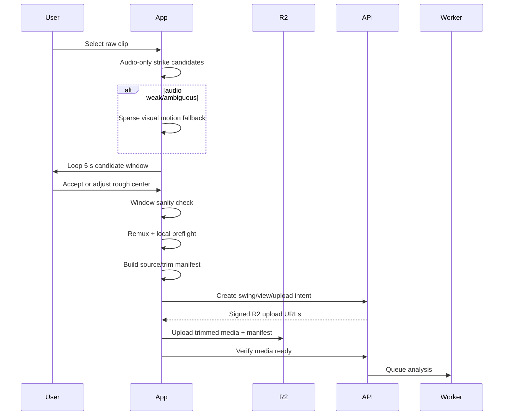

# 01 - Pre-Upload Capture, Trim, Validation, and Ingest

## 1. Goal

Minimize the amount of media uploaded and processed without making the user wait or requiring them to find the exact impact frame.

The trim subsystem answers only:

> Which short interval should be uploaded?

It does **not** measure exact impact.

## 2. Current fast path to preserve

When a user selects a 30 to 60 second video:

1. Read the audio track only.
2. Score strike-shaped transients.
3. Prefer a whoosh followed by a click over a practice-swing whoosh.
4. Down-weight, but do not exclude, roughly the first/last five seconds.
5. Return up to three plausible candidates.
6. Strongest candidate wins unless a later candidate is at least 60 percent as strong, then prefer the later candidate.
7. If no plausible transient exists, use fallback logic.
8. Center a five-real-second review window at the candidate: 2.5 seconds before and 2.5 seconds after.
9. For phone slow motion, convert real-time seconds through the slow-motion factor before selecting presentation-timeline timestamps.
10. Let the user accept the window or drag one rough "where you hit the ball" marker.
11. Add about 0.1 seconds of trim slack per side.
12. Remux without re-encoding. Snap start to the previous keyframe if required.

The normal audio path should remain extremely fast and should not wait for video CV.

## 3. New conditional visual fallback

### When to run it

Run only when any of these are true:

- no audio strike candidate;
- top audio candidates are too close in score;
- audio quality/SNR is poor;
- candidate window fails a cheap swing-motion sanity check;
- an imported file has no usable audio.

### What it does

It is intentionally not pose analysis and not club analysis.

Recommended experiment:

```text
input: raw clip
resolution: 160 to 320 px long side
sample rate: 4 to 8 frames/sec
features:
  frame-difference motion energy
  coarse optical-flow energy if needed
  optional person-area motion mask
output:
  candidate swing-motion intervals + confidence
```

Rank candidate windows using:

```text
trim_score =
    audio_candidate_score
  + swing_motion_likelihood
  + plausible_duration_prior
  + edge_prior
```

If audio is absent, use motion intervals to replace the current fixed "near the end" fallback. Keep the existing end-of-clip heuristic as the final low-confidence fallback.

## 4. Window sanity check

Before the user uploads, evaluate the selected five-second interval at low cost.

The check asks only:

> Does this interval plausibly contain one golf swing motion envelope?

It does not ask whether the selected mark is exact impact.

If confidence is low:

- warn that the app may not see a swing in the selected section;
- keep the user on the trim screen;
- offer auto-recenter to the next-best candidate;
- still allow an explicit user override.

The objective is to prevent the only unrecoverable server failure: the real swing was trimmed out before upload.

## 5. Trim/source manifest

Create this manifest from the original asset before remux and update it after remux.

Example:

```json
{
  "source_manifest_version": "1.0.0",
  "source": {
    "asset_id": "local-uuid",
    "container_duration_ms": 41600,
    "presentation_fps": 30.0,
    "capture_fps": 240.0,
    "capture_fps_confidence": 0.98,
    "capture_fps_source": "device_metadata",
    "slowmo_factor": 8.0,
    "width": 1920,
    "height": 1080,
    "codec": "h264",
    "audio_present": true
  },
  "trim": {
    "requested_center_real_ms": 14930,
    "requested_real_start_ms": 12430,
    "requested_real_end_ms": 17430,
    "pad_real_ms": 100,
    "requested_file_start_pts_ms": 99440,
    "requested_file_end_pts_ms": 139440,
    "actual_remux_start_pts_ms": 98800,
    "actual_remux_end_pts_ms": 140200
  },
  "client_detection": {
    "audio_candidates": [
      {"real_ms": 14930, "score": 0.91},
      {"real_ms": 9180, "score": 0.42}
    ],
    "visual_fallback_used": false,
    "window_motion_confidence": 0.89,
    "user_adjusted_window": false
  }
}
```

### Important authority rule

The analyzer may use source/capture/timeline facts from this manifest.

It must ignore `requested_center_real_ms` and any user-adjusted mark when deriving exact impact.

## 6. Local post-remux preflight

Before upload, probe the actual trimmed output.

Validate:

- video stream exists;
- audio presence is recorded, not assumed;
- width/height are supported;
- codec/container are supported;
- file size under hard limit;
- trim boundaries are non-empty;
- real-world duration is in expected envelope;
- presentation duration is consistent with slow-motion mapping;
- capture FPS is known or explicitly unknown;
- estimated real frame count is plausible;
- no impossible 5-second-real-window to 40-second-real interpretation mismatch;
- actual remux start/end are recorded.

If the local facts contradict the source manifest, fail before network upload and regenerate/retrim.

The server repeats validation because the client is not trusted.

## 7. Upload flow



## 8. Optional latency experiment: overlap upload and worker preparation

Do not make this default until measured.

Possible flow:

1. user confirms upload;
2. API creates job immediately;
3. direct R2 upload begins;
4. worker/container/model preparation begins concurrently;
5. worker waits briefly for media-ready signal;
6. inference begins as soon as object verification completes.

Compare against scale-to-zero baseline. Track wasted warm starts for canceled/failed uploads.

## 9. Pre-upload metrics

Do not evaluate the trim system by exact impact-frame accuracy. Its job is window selection.

Track:

| Metric | Definition |
|---|---|
| impact-in-window rate | true impact exists in uploaded interval |
| full-swing-in-window rate | required address/takeaway through finish survives trim |
| catastrophic trim rate | true swing or impact removed before upload |
| auto-seed accept rate | user accepts without adjustment |
| wrong-swing rate | practice/wrong strike chosen when multiple swings exist |
| silent-audio recovery | visual fallback finds correct swing when audio does not |
| time-to-preview p50/p95 | select clip to looping preview |
| visual fallback invocation rate | percentage of clips paying visual-scan cost |
| visual fallback device time | decode/CV time for fallback |
| battery/thermal regression | repeated-session impact |

## 10. Acceptance criteria

- High-confidence audio path has no meaningful latency regression.
- The user's rough mark is absent from server impact features.
- Every uploaded clip has an authoritative source/trim manifest.
- Known slow-motion fixtures cannot produce the prior 2,445-frame interpretation bug.
- Local preflight rejects malformed duration/frame-rate mappings before R2 upload.
- Visual fallback is feature-flagged and ships only if it lowers manual correction or catastrophic trim rate without hurting the normal path.
