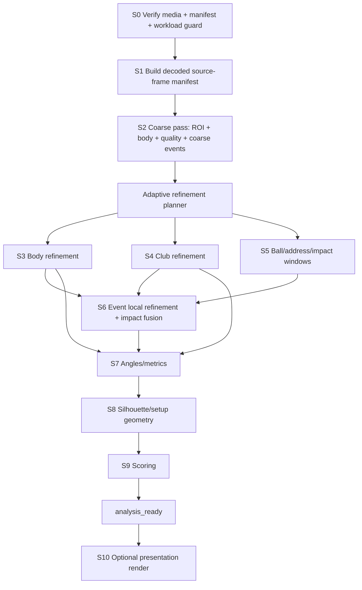

# 02 - Target Server Architecture and Analysis Pipeline

## 1. Keep the current service topology initially

No new platform is required for the redesign.

| Component | Role |
|---|---|
| React Native / Expo | capture/import, trim, preflight, upload, frame-exact render |
| Next.js / Vercel | ingest API, signed URLs, job status, revision discovery |
| Supabase Postgres | swing/view/job state, progress, corrections, configuration references |
| Cloudflare R2 | source media, manifests, models, immutable analysis revisions |
| Upstash QStash | delivery/retry of queued analysis jobs |
| Modal | server-side Python CV and GPU compute |

Add infrastructure only if measured scale/latency requires it.

## 2. Worker DAG



## 3. Stage responsibilities

### S0 - Verify and guard

CPU/metadata only.

- verify R2 objects and manifest hash;
- parse source/capture FPS and slow-motion factor;
- estimate unique decoded frame count;
- validate duration limits;
- reject unsupported codecs/resolution;
- compute planned per-stage frame budget;
- reject impossible or oversized workloads before GPU allocation;
- classify known deterministic failures as non-retryable.

### S1 - Source-frame manifest

Decode/probe enough to create stable frame identity.

For every decoded source frame record:

```text
source_frame_id
encoded_order / decode order where useful
source_pts
source_duration
real_capture_time or derived real_time
canonical_playback_frame_id
canonical_playback_pts
```

Do not duplicate 30 fps frames to create a fake 60 fps analysis stream.

### S2 - Fast coarse pass

Goal: enough understanding to plan the expensive work.

Outputs:

- golfer/person ROI;
- view quality and likely face-on/down-the-line class;
- coarse whole-body pose around 30 Hz;
- motion curve;
- candidate address/top/impact/finish neighborhoods;
- active swing interval;
- initial confidence/quality flags.

This stage should generate the first progressive artifact.

### Adaptive refinement planner

Inputs:

- frame manifest;
- capture FPS;
- coarse pose/events;
- quality/blur;
- club type if known;
- view;
- required scoring checks.

Outputs explicit frame sets for every downstream subsystem.

Example:

```json
{
  "pose_direct_frames": [0, 8, 16, 24, 32],
  "pose_forced_frames": [411, 612, 894],
  "club_global_frames": [320, 325, 330],
  "club_native_window": [320, 760],
  "ball_windows": [[0, 90], [580, 640]],
  "silhouette_frames": [22, 23, 24],
  "event_refine_windows": {
    "top": [390, 430],
    "impact": [590, 635],
    "finish": [850, 940]
  }
}
```

Every chosen frame set is stored in the artifact for reproducibility.

### S3 - Body refinement

- direct inference up to roughly 60 Hz over active swing;
- force exact event/scoring frames regardless of cadence;
- propagate missing display frames separately;
- compute confidence-aware geometry.

### S4 - Club refinement

- sparse full-frame club-region detector;
- crop propagation between detector observations;
- native-rate high-resolution club-pose model inside active window;
- retain multiple plausible low-confidence candidates;
- global/sequence-level path solve;
- explicit observed/missing/estimated states.

### S5 - Ball windows

- ball at address/setup;
- ball near expected impact;
- ball disappearance/motion after contact where visible;
- no whole-clip ball detection.

### S6 - Events and impact

- refine event neighborhoods at native frame rate where needed;
- fuse audio, visual club/ball, body phase, and quality evidence;
- output exact frame ID + ms + confidence + evidence breakdown.

### S7 - Metrics

- compute per-frame or event-frame geometry;
- preserve handedness/view gating;
- attach provenance/confidence dependencies to every metric.

### S8 - Silhouette/setup geometry

Use setup/address frame set only. Do not segment the whole clip unless a later feature explicitly requires it.

### S9 - Scoring

Pure deterministic function of:

- versioned analysis artifact;
- versioned scoring config;
- geometry provenance rules;
- confidence gates;
- club/view/handedness context.

### S10 - Presentation rendering

After `analysis_ready`:

- share/burn-in video;
- optional contact sheet;
- thumbnails/stills not required for interactive analysis.

## 4. Progressive revisions

Recommended user-facing milestones:

### Revision 1: `coarse_ready`

- media/frame facts;
- filming-quality feedback;
- coarse/provisional skeleton;
- provisional phase/event neighborhoods.

### Revision 2: `body_ready`

- final body observations;
- dense display propagation;
- refined non-impact events where available.

### Revision 3: `club_ready`

- club observations;
- trace;
- gap/uncertainty states.

### Revision 4: `analysis_ready`

- final impact/events;
- metrics;
- scoring;
- final confidence and abstentions.

Presentation media can be Revision 5 or a separate artifact family.

## 5. Parallelism

After the coarse pass, these branches can run concurrently if GPU/CPU resources and dependencies permit:

```text
body refinement
club refinement
ball windows
server audio features
```

Do not parallelize merely to increase instantaneous resource use. Measure wall-time versus billed compute.

## 6. Checkpointing

Every expensive stage writes an immutable stage checkpoint before the next stage begins.

A retry should be able to resume from the latest compatible checkpoint if:

- media hash matches;
- analysis code/model versions match;
- frame manifest version matches;
- stage policy/config matches.

Never rerun completed expensive stages after a downstream deterministic failure.

## 7. Job state machine

```text
created
uploading
uploaded
verified
queued
media_ready
coarse_running
coarse_ready
body_refining
club_refining
event_refining
scoring
analysis_ready
presentation_rendering
complete
failed_retryable
failed_terminal
```

`analysis_ready` is the main product completion event.

## 8. Failure behavior

- Low pose quality may terminally fail geometry while preserving the video swing.
- Low club quality may still produce a body-only report with club checks abstained.
- Low audio quality never fails the job by itself.
- A malformed timeline fails before GPU inference.
- A deterministic timeout due to workload size is terminal unless a specific lower-cost fallback policy exists.
- Infrastructure death may retry from checkpoints.
