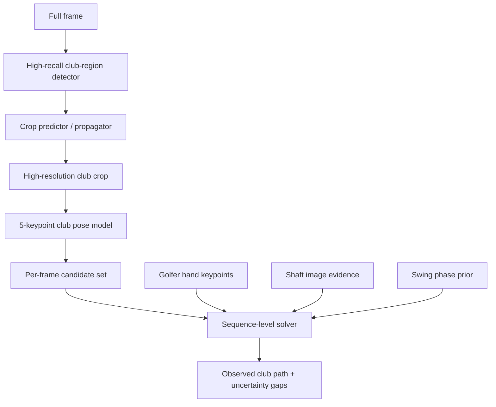

# 05 - Club Tracking and Trace Architecture

## 1. Why this subsystem changes the most

Club tracking is the hardest and least measurable part of the current system.

Known issues include:

- tiny club head;
- high apparent speed;
- motion blur;
- dark club against dark backgrounds;
- shaft crossing the golfer;
- detector false positives;
- dropouts;
- visually bad traces despite reasonable per-frame detections;
- no hand-labeled positional ground truth in the current production evaluation set.

The redesign should treat the club as a structured articulated/rigid object, not as unrelated head and shaft outputs.

## 2. CADDIE-inspired target representation

Use a compact five-keypoint club representation.

Initial proposed label set:

```text
1. grip
2. shaft midpoint
3. hosel / neck
4. head inner/reference point
5. head outer/reference point
```

From these, derive:

- grip point;
- shaft axis;
- apparent shaft length;
- hosel;
- club-head center/reference point;
- club-head orientation proxy when visible;
- crop/visibility state.

The exact head-point definitions must be written into the annotation manual so labels are consistent across driver, fairway wood, iron, and wedge shapes.

## 3. Target pipeline



## 4. Sparse full-frame localization

The global detector's job is primarily to acquire/reacquire a generous club crop, not to publish final head geometry.

Starting adaptive policy:

```text
unlocked / reacquiring: every native frame or tight cadence
locked: approximately every 5 native frames
very stable: experiment with wider interval
high uncertainty / crop near edge: densify
```

CADDIE's published detector-interval experiment is strong evidence that this pattern can work for golf, but SwingSage must reproduce it on its own footage before freezing the stride.

## 5. Native-rate crop pose

Inside the active swing window, especially downswing through early follow-through, run the compact club-pose model at native frame rate when the benchmark shows value.

Why spend 240 fps here:

- smaller inter-frame displacement;
- better reacquisition opportunities;
- more temporal evidence through short occlusions;
- more precise impact-neighborhood geometry;
- lower cost than full-frame heavy detection on every frame.

High FPS does not guarantee a sharp club head. Motion blur depends strongly on exposure/shutter conditions.

## 6. Candidate retention

Do not hard-drop all low-confidence detections early.

For each frame retain a bounded candidate set, for example top K=3 to 5 after minimum plausibility filters.

```json
{
  "source_frame_id": 612,
  "candidates": [
    {
      "keypoints": "...",
      "model_confidence": 0.48,
      "shaft_evidence": 0.82,
      "grip_hand_consistency": 0.91,
      "apparent_length_score": 0.88,
      "blur_severity": 0.63
    }
  ]
}
```

The useful idea from ByteTrack is to allow lower-confidence observations to participate in association. Do not adopt ByteTrack's general MOT assumptions as the whole architecture.

## 7. Sequence-level solver

Choose the most plausible observed sequence globally or over phase-sized chunks.

A Viterbi-like dynamic program, beam search, factor graph, or equivalent optimizer should score:

```text
local club-pose evidence
+ shaft image evidence
+ grip proximity to golfer hands
+ apparent club-length consistency
+ feasible angular velocity/acceleration
+ swing-phase direction
+ crop continuity
+ visibility/occlusion model
- impossible spatial jumps
- implausible head/hosel geometry
- abrupt unobserved identity switches
```

The goal is **candidate selection**, not after-the-fact visual smoothing.

## 8. Optional tracker candidates

Benchmark as secondary candidate generators only:

- ByteTrack-inspired low-confidence association;
- OC-SORT observation-centric short-gap association;
- optical flow;
- TAPIR/CoTracker-style point propagation;
- motion-aware tiny-object networks such as TrackNet-family concepts.

No tracker becomes authoritative without beating the ground-truth benchmark.

## 9. Gap policy

Current product behavior of dashed uncertainty is conceptually sound.

Store states such as:

```text
observed
tracked_from_observation
estimated_for_display
missing
```

Rules:

- long unsupported gaps remain missing;
- display can connect gaps with dashed geometry;
- a fitted arc does not become a measured point;
- scoring does not use estimated club geometry unless a rule explicitly permits it and validation proves it safe.

The prior SwingSage testing found that spline/physics reconstruction did not beat the simple straight-gap representation. Do not change this until positional ground truth shows a real win.

## 10. Motion-blur experiment

Add blur as an explicit label/quality dimension:

```text
none
mild
heavy
shaft_streak_visible
head_streak_visible
unusable
```

Experiments:

1. synthetic directional motion-blur augmentation;
2. auxiliary blur-quality head;
3. blur-direction feature as sequence-solver evidence;
4. confidence calibration conditioned on blur severity;
5. capture guidance/quality warning based on observed blur.

Adopt only if it improves positional and catastrophic-error metrics.

## 11. Club ground-truth metrics

Primary metrics:

- PCK@2/5/10 px;
- error normalized by club length;
- head-center median/p95 error;
- hosel error;
- shaft angular error;
- visible-frame precision and recall;
- false-positive rate;
- confidence calibration;
- gap count and gap-duration distribution;
- catastrophic jump rate;
- reacquisition time;
- impact-window error;
- frame-aligned trace point error over all visible GT frames.

Secondary visual metrics such as smoothness are diagnostic only.

## 12. Training plan

### Data ownership

Build a SwingSage-specific consented corpus as the long-term production asset.

External golf datasets can be used for research/evaluation only when license permits. Some notable golf datasets are non-commercial.

### Active learning loop

1. run current model over new consented swings;
2. score uncertainty, blur, disagreement, and failure cases;
3. prioritize those frames for annotation;
4. retrain;
5. validate on golfer-disjoint frozen holdout;
6. deploy only if all release gates pass.

### Split rule

Split by golfer and source recording, never adjacent frames from one swing across train/test.

## 13. Acceptance gates before replacing current club pipeline

- lower median and p95 head-center error;
- lower false-positive rate or no regression;
- lower catastrophic jump rate;
- equal/better shaft angle accuracy;
- equal/better impact-window usable coverage;
- confidence calibration is not worse;
- no increase in high-confidence wrong club-dependent scoring;
- p95 latency/cost within system SLO.
