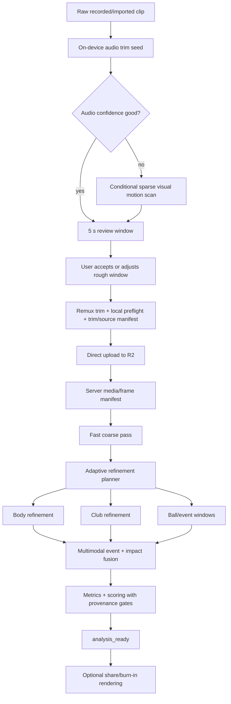

# SwingSage Video Analysis Architecture and Implementation Plan v2

**Status:** Recommended implementation plan  
**Date:** 2026-08-26  
**Audience:** Coding AI / implementation engineer  
**Primary optimization goals:** user-perceived speed, end-to-end latency, geometric accuracy, confidence calibration, unit cost, and frame-exact review

## Executive decision

Preserve every real captured frame, but **stop treating playback frame rate as model inference rate**.

A 240 fps swing should retain all 240 real samples per second for playback, exact scrubbing, club analysis, and future re-analysis. Whole-body pose, ball detection, silhouette, event spotting, and full-frame club localization should run only at the cadence and resolution each subsystem actually needs.

The target design is a hierarchical, coarse-to-fine analyzer:



The user-selected "where you hit the ball" mark exists only to choose the upload window. **The server must never use it to determine impact, confidence, scoring, or ground truth.** Exact impact is rediscovered from the uploaded clip.

## Core architectural rules

1. **Frame identity, playback timing, and inference cadence are separate concepts.**
2. **No raw video goes to an LLM.** Geometry is deterministic CV output.
3. **Every observation has provenance and confidence.** Missing/abstain is valid.
4. **Display interpolation is not measurement.** Scoring-critical geometry can require direct inference.
5. **240 fps compute is spent where it buys information.** Most importantly, native-rate club crop geometry and native-frame event refinement.
6. **Impact is multimodal.** Audio is useful evidence but is not authoritative by itself.
7. **Club accuracy must become falsifiable.** Position ground truth and trace metrics precede algorithm tuning.
8. **Render media is not on the interactive critical path.** Clients already render geometry.
9. **Guard work before GPU spend.** Bad timelines, impossible frame counts, and malformed slow-motion mappings fail early.
10. **Optimize dollars per accepted swing, not isolated model FPS.**

## Recommended starting observation policy

These are benchmark starting points, not immutable constants.

| Subsystem | 30/60 fps source | 120 fps source | 240 fps source | Scoring rule |
|---|---|---|---|---|
| Coarse body | ~30 Hz full clip | ~30 Hz full clip | ~30 Hz full clip | not final |
| Final body | up to 60 Hz active swing | up to 60 Hz | up to 60 Hz | force direct frames when required |
| Body display | dense playback index | propagated between observations | propagated between observations | propagated points cannot silently score |
| Club full-frame region detector | adaptive | adaptive | adaptive | localization only |
| Club crop pose | native rate in active swing when useful | native rate | native rate | direct/observed provenance |
| Ball | setup + impact windows | same | same | visual witness |
| Events | coarse + local refinement | same | native-frame refinement | confidence-gated |
| Silhouette | setup/address frame set | same | same | no full-clip segmentation |
| Share/burn-in render | after analysis_ready | same | same | not blocking results |

For the club full-frame detector, start experiments around **every fifth native frame after lock**, every frame while reacquiring, and tighter around difficult transitions only if the internal benchmark shows value. This pattern is supported by the 2026 CADDIE golf-club pose work, but the exact stride must be validated on SwingSage footage.

## Performance targets

These are engineering gates, not promises until benchmarked.

| Milestone | Initial target |
|---|---:|
| High-confidence trim preview | feels immediate; preserve current sub-second audio path where possible |
| Coarse server preview p95 | < 20 s after upload complete |
| Body/events usable p95 | < 45 s |
| Stretch final analysis p95 | < 90 s |
| Hard final SLO p95 | < 180 s |
| Hard final SLO p99 | < 300 s |
| 240 fps GPU/worker cost planning ceiling | <= $0.06 per view initially |
| Frame/timeline identity mismatch | 0 |
| Propagated geometry represented as direct | 0 |
| Deterministic timeout blindly retried | 0 |
| High-confidence catastrophic impact miss on golden set | 0 |

## Package map

| File | Purpose |
|---|---|
| `00_product_requirements_and_decisions.md` | Non-negotiable product guarantees and updated decisions |
| `01_pre_upload_capture_trim_ingest.md` | Audio-first trimming, conditional visual fallback, local preflight, direct upload |
| `02_target_architecture_pipeline.md` | Full server-side staged DAG and progressive result flow |
| `03_video_timeline_frame_policy_playback.md` | Source frame identity, slow-motion timing, PTS mapping, CFR playback, per-stage frame policy |
| `04_pose_body_tracking_scoring.md` | Body pose, ROI, decimation, propagation, smoothing, direct-only scoring |
| `05_club_tracking.md` | CADDIE-inspired five-keypoint club architecture, sequence solver, gap rules, blur experiments |
| `06_events_impact_detection.md` | Event spotting, native refinement, multimodal impact fusion, audio calibration |
| `07_performance_gpu_cost.md` | GPU decode, batching, TensorRT experiments, warm strategy, cost model |
| `08_ground_truth_benchmark_evaluation.md` | Annotation plans, metrics, datasets, gates, golden set |
| `09_data_contracts_versioning.md` | Proposed JSON contracts, provenance, revisions, compatibility |
| `10_infrastructure_jobs_observability.md` | R2/QStash/Modal/Postgres orchestration, idempotency, retries, checkpoints, metrics |
| `11_experiment_plan.md` | Ordered experiments and decision gates |
| `12_migration_rollout.md` | Shadow mode, feature flags, migration, rollback |
| `13_implementation_backlog.md` | Coder-AI-sized work packages with acceptance criteria |
| `14_sources_and_evidence.md` | Sources, verified facts, hypotheses, and licensing cautions |
| `reference/` | Original problem brief and prior research artifacts for context |

## Implementation order

```text
P0  instrumentation + timeline correctness + pre-upload manifests/guards
P1  ground-truth evaluator + adaptive frame planner
P2  body/event coarse-to-fine path + direct-only scoring provenance
P3  CADDIE-style club prototype + sequence solver
P4  multimodal impact refinement
P5  runtime optimization: GPU decode, batching, FP16/TensorRT
P6  progressive artifacts + deferred rendering
P7  conditional visual trim fallback + warm/session optimizations
P8  INT8 / alternative trackers / advanced blur models only if evidence supports them
```

## What not to do

- Do not run every analyzer on every 240 fps frame.
- Do not turn the user's trim mark into an impact prior.
- Do not make audio authoritative for exact visual impact.
- Do not treat propagated/interpolated body points as directly measured.
- Do not replace missing club evidence with visually pleasing curves unless ground truth proves an improvement and provenance remains explicit.
- Do not use coverage percentage as the primary club accuracy metric.
- Do not choose a GPU by raw speed alone.
- Do not add infrastructure such as Kafka, Kubernetes, or a permanent GPU fleet before the current stack proves insufficient.
- Do not retry deterministic workload failures as if they were transient infrastructure failures.

## Definition of done for the redesign

The redesign is production-ready when:

1. Source/playback frame identity is regression-tested with zero mismatch across supported capture/import types.
2. Pre-upload trim catastrophically removes the true swing at a measured acceptably low rate, with a recovery path when audio is weak.
3. Every club/event/body accuracy claim is backed by labeled ground truth.
4. Scoring records the provenance and confidence of every geometry/event dependency.
5. 240 fps swings meet the latency/cost gates on the production worker class or an explicitly selected replacement.
6. Progressive results fail safely and final revisions are deterministic and reproducible.
7. A failed or timed-out stage can resume without repeating already-completed expensive work.
